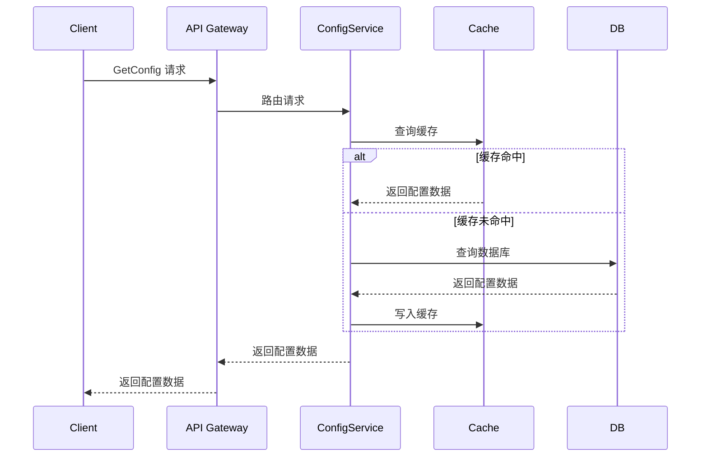
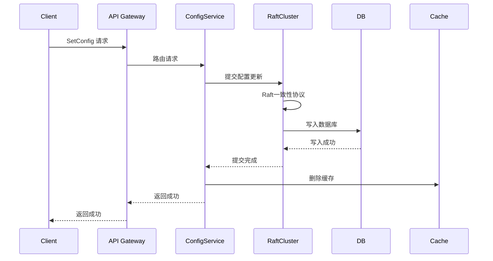
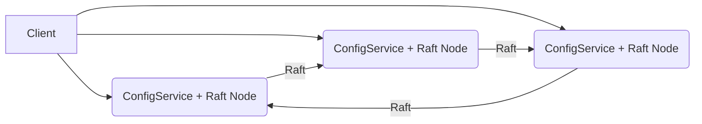

# 分布式配置中心概要设计文档

## 1. 简介

本设计文档描述了一个基于Rust语言，采用`tokio`异步框架和`actix-web` web框架，使用PostgreSQL作为持久化存储，Redis作为缓存，Raft算法保证数据一致性的分布式配置中心。该配置中心支持多种配置格式、RBAC权限管理、多维度配置隔离、版本控制、加密、灰度发布、监控告警等功能，旨在提供一个高可用、高性能、易扩展的配置管理解决方案。

## 2. 需求分析

### 2.1 功能性需求

* **配置管理：**
  * 支持配置的创建、读取、更新、删除。
  * 支持配置的版本控制和回滚。
  * 支持配置的加密和解密。
  * 支持多种配置格式（YAML、Properties等），并自动校验其合法性。
  * 支持通过Namespace、Department、Application、Domain、Environment等多维度进行配置隔离。
  * 支持配置的灰度发布和灰度回滚。
* **权限管理：**
  * 支持基于角色的访问控制（RBAC），包括管理员、开发人员、运维人员等角色。
  * 使用Casbin进行权限管理，Policy从数据库读取，支持动态更新。
* **接口：**
  * 提供gRPC和RESTful接口。
* **存储：**
  * 使用PostgreSQL进行持久化存储。
  * 使用Redis进行缓存，采用Cache-Aside模式。
* **一致性：**
  * 使用Raft算法保证数据一致性。
* **部署：**
  * 支持分布式部署和非中心化部署。
* **监控告警：**
  * 支持配置变更的监控和告警。
  * 支持系统运行状态的监控和告警。
* **数据管理：**
  * 支持配置中心的数据备份和恢复。
  * 支持配置中心的数据同步到其他配置中心。
* **审计：**
  * 支持操作审计，记录用户的操作行为。

### 2.2 非功能性需求

* **高可用性：** 配置中心应具有高可用性，避免单点故障。 **性能指标：**  配置中心的可用性达到 99.999%。
* **高性能：** 接口响应速度快，支持高并发访问。 **性能指标：**  接口的平均 TPS（每秒事务数）不低于 1000，所有请求的平均响应时间低于 200ms，99% 的请求响应时间低于 500ms。
* **可扩展性：** 易于扩展，可以方便地增加节点或调整配置。
* **安全性：**  保证配置数据的安全性，防止未经授权的访问和修改。
* **可维护性：** 代码结构清晰，易于维护和升级。

## 3. 总体架构设计

### 3.1 架构图

```mermaid
graph LR
    Client(客户端) -->|gRPC/REST| API Gateway(API网关)
    API Gateway --> Auth(认证服务)
    API Gateway -->|路由| ConfigService(配置服务)
    ConfigService --> Cache(Redis缓存)
    ConfigService --> DB(PostgreSQL数据库)
    ConfigService --> RaftCluster(Raft集群)
    RaftCluster --> DB
    Monitor(监控服务) --> ConfigService
    Admin(管理后台) --> API Gateway
    DataSync(数据同步服务) --> RaftCluster
    Backup(备份服务) --> DB
    Audit(审计服务) --> DB

    style Client fill:#f9f,stroke:#333,stroke-width:2px
    style API Gateway fill:#ccf,stroke:#333,stroke-width:2px
    style ConfigService fill:#ccf,stroke:#333,stroke-width:2px
    style Cache fill:#ffc,stroke:#333,stroke-width:2px
    style DB fill:#ddf,stroke:#333,stroke-width:2px
    style RaftCluster fill:#cff,stroke:#333,stroke-width:2px
    style Monitor fill:#fcc,stroke:#333,stroke-width:2px
    style Admin fill:#fcf,stroke:#333,stroke-width:2px
    style DataSync fill:#cfc,stroke:#333,stroke-width:2px
    style Backup fill:#cff,stroke:#333,stroke-width:2px
    style Audit fill:#ccf,stroke:#333,stroke-width:2px
```

### 3.2 组件说明

* **API Gateway（API网关）：** 负责接收客户端的gRPC和RESTful请求，进行认证鉴权，并将请求路由到相应的服务。
* **认证服务（Auth）：** 负责用户身份认证和授权。
* **配置服务（ConfigService）：** 核心服务，负责配置的管理、读取、更新、删除等操作。
* **Redis缓存（Cache）：** 缓存配置数据，提高接口响应速度。
* **PostgreSQL数据库（DB）：** 持久化存储配置数据、权限数据、审计日志等。
* **Raft集群（RaftCluster）：** 保证配置数据的一致性，负责配置数据的复制和同步。
* **监控服务（Monitor）：** 负责监控配置中心的运行状态，发送告警信息。
* **管理后台（Admin）：** 提供配置管理的Web界面，方便管理员进行配置管理。
* **数据同步服务（DataSync）：** 负责将配置数据同步到其他配置中心。
* **备份服务（Backup）：** 负责定期备份配置中心的数据。
* **审计服务（Audit）：** 负责记录用户的操作行为，提供审计功能。

## 4. 详细设计

### 4.1 数据库设计

```mermaid
erDiagram
    namespace {
        string id PK
        string name
        string description
        datetime create_time
        datetime update_time
    }

    department {
        string id PK
        string name
        string description
        datetime create_time
        datetime update_time
    }

    application {
        string id PK
        string name
        string description
        datetime create_time
        datetime update_time
    }

    domain {
        string id PK
        string name
        string description
        datetime create_time
        datetime update_time
    }

    environment {
        string id PK
        string name
        string description
        datetime create_time
        datetime update_time
    }

    config {
        string id PK
        string namespace_id FK
        string department_id FK
        string application_id FK
        string domain_id FK
        string environment_id FK
        string key
        string value
        string format
        bool is_encrypted
        string description
        datetime create_time
        datetime update_time
    }

    config_version {
        string id PK
        string config_id FK
        string value
        string version
        string description
        datetime create_time
    }

    role {
        string id PK
        string name
        string description
        datetime create_time
        datetime update_time
    }

    user {
        string id PK
        string username
        string password
        string email
        datetime create_time
        datetime update_time
    }

    user_role {
        string user_id FK
        string role_id FK
    }

    casbin_rule {
        string id PK
        string ptype
        string v0
        string v1
        string v2
        string v3
        string v4
        string v5
    }

    audit_log {
        string id PK
        string user_id FK
        string operation
        string resource
        string detail
        datetime create_time
    }

    config ||--|| namespace : belongs to
    config ||--|| department : belongs to
    config ||--|| application : belongs to
    config ||--|| domain : belongs to
    config ||--|| environment : belongs to
    config ||--|| config_version : has many
    user_role ||--|| user : has
    user_role ||--|| role : has
    audit_log ||--|| user : performed by
```

**表结构说明:**

* `namespace`：命名空间表，用于配置隔离。
* `department`：部门表，用于配置隔离。
* `application`：应用表，用于配置隔离。
* `domain`：域表，用于配置隔离。
* `environment`：环境表，用于配置隔离。
* `config`：配置表，存储配置信息。
* `config_version`：配置版本表，存储配置的历史版本。
* `role`：角色表，存储角色信息。
* `user`：用户表，存储用户信息。
* `user_role`：用户角色关联表，存储用户和角色的关系。
* `casbin_rule`：Casbin规则表，存储RBAC策略。
* `audit_log`：审计日志表，记录用户的操作行为。

**索引设计:**

* `config` 表:
  * 在 `namespace_id`, `department_id`, `application_id`, `domain_id`, `environment_id`, `key` 上建立联合索引，提高配置查找效率。
* `config_version` 表:
  * 在 `config_id` 上建立索引，提高版本查询效率。
* `user_role` 表:
  * 在 `user_id` 和 `role_id` 上分别建立索引，提高用户角色查询效率。
* `audit_log` 表:
  * 在 `user_id` 和 `create_time` 上建立索引，提高审计日志查询效率。

**性能指标：**  单表数据量超过 1000 万行时，查询响应时间不超过 1 秒。

### 4.2 接口设计

#### 4.2.1 gRPC接口

```protobuf
syntax = "proto3";

package configcenter;

service ConfigService {
  rpc GetConfig (GetConfigRequest) returns (GetConfigResponse) {}
  rpc SetConfig (SetConfigRequest) returns (SetConfigResponse) {}
  rpc DeleteConfig (DeleteConfigRequest) returns (DeleteConfigResponse) {}
  rpc GetConfigVersion (GetConfigVersionRequest) returns (GetConfigVersionResponse) {}
}

message GetConfigRequest {
  string namespace = 1;
  string department = 2;
  string application = 3;
  string domain = 4;
  string environment = 5;
  string key = 6;
}

message GetConfigResponse {
  string value = 1;
}

message SetConfigRequest {
  string namespace = 1;
  string department = 2;
  string application = 3;
  string domain = 4;
  string environment = 5;
  string key = 6;
  string value = 7;
  string format = 8;
  bool is_encrypted = 9;
  string description = 10;
}

message SetConfigResponse {
  bool success = 1;
}

message DeleteConfigRequest {
  string namespace = 1;
  string department = 2;
  string application = 3;
  string domain = 4;
  string environment = 5;
  string key = 6;
}

message DeleteConfigResponse {
  bool success = 1;
}

message GetConfigVersionRequest {
  string namespace = 1;
  string department = 2;
  string application = 3;
  string domain = 4;
  string environment = 5;
  string key = 6;
  string version = 7;
}

message GetConfigVersionResponse {
  string value = 1;
}
```

#### 4.2.2 RESTful接口

```
GET /config?namespace={namespace}&department={department}&application={application}&domain={domain}&environment={environment}&key={key}
POST /config
DELETE /config?namespace={namespace}&department={department}&application={application}&domain={domain}&environment={environment}&key={key}
GET /config/version?namespace={namespace}&department={department}&application={application}&domain={domain}&environment={environment}&key={key}&version={version}
```

**接口说明:**

* `GET /config`：获取配置信息。
* `POST /config`：设置配置信息。
* `DELETE /config`：删除配置信息。
* `GET /config/version`：获取指定版本的配置信息。

**安全性设计:**

* 使用JWT进行身份验证，确保只有授权用户才能访问配置中心。
* 使用HTTPS进行数据加密，防止数据在传输过程中被窃取。

**性能指标：**  接口的平均 TPS（每秒事务数）不低于 1000。

### 4.3 模块设计

```
config-center/
├── src/
│   ├── main.rs               # 应用入口
│   ├── config.rs             # 启动配置加载和管理
│   ├── api/                # API接口模块
│   │   ├── grpc/           # gRPC接口实现
│   │   │   ├── config_service.rs
│   │   │   └── mod.rs
│   │   ├── rest/           # RESTful接口实现
│   │   │   ├── config_handler.rs
│   │   │   └── mod.rs
│   │   └── mod.rs
│   ├── db/                 # 数据库访问模块
│   │   ├── models.rs       # 数据库模型定义
│   │   ├── postgres.rs     # PostgreSQL数据库操作
│   │   └── mod.rs
│   ├── cache/              # 缓存模块
│   │   ├── redis.rs        # Redis缓存操作
│   │   └── mod.rs
│   ├── raft/               # Raft一致性算法模块
│   │   ├── node.rs         # Raft节点实现
│   │   ├── state_machine.rs  # 状态机实现
│   │   └── mod.rs
│   ├── auth/               # 权限管理模块
│   │   ├── casbin.rs       # Casbin权限控制
│   │   └── mod.rs
│   ├── monitor/            # 监控模块
│   │   ├── metrics.rs      # 指标收集
│   │   ├── alert.rs        # 告警服务
│   │   └── mod.rs
│   ├── audit/              # 审计模块
│   │   ├── logger.rs       # 审计日志记录
│   │   └── mod.rs
│   ├── types/              # 类型定义
│   │   ├── config_data.rs  # 配置数据类型
│   │   └── mod.rs
│   └── utils/              # 工具模块
│       ├── config_validator.rs  # 配置文件校验
│       ├── crypto.rs         # 加密解密
│       └── mod.rs
├── Cargo.toml            # 项目依赖管理
└── .env                  # 环境变量配置文件
```

**模块说明:**

* `main.rs`：应用入口，负责启动各个模块。
* `config.rs`：负责加载和管理启动配置，例如数据库连接信息、Redis连接信息等。
* `api/`：包含gRPC和RESTful接口的实现。
* `db/`：包含数据库访问相关的代码，例如数据库连接、SQL查询等。
* `cache/`：包含缓存相关的代码，例如Redis连接、缓存读写等。
* `raft/`：包含Raft一致性算法的实现，例如Raft节点、状态机等。
* `auth/`：包含权限管理相关的代码，例如Casbin策略加载、权限验证等。
* `monitor/`：包含监控相关的代码，例如指标收集、告警发送等。
* `audit/`：包含审计相关的代码，例如审计日志记录等。
* `types/`：包含类型定义，例如配置数据的结构体等。
* `utils/`：包含工具函数，例如配置文件校验、加密解密等。

**模块化原则：** 每个模块只负责单一职责，模块间通过清晰的接口进行交互。

### 4.4 核心流程设计

#### 4.4.1 配置读取流程



#### 4.4.2 配置更新流程



### 4.5 配置中心数据一致性方案设计

#### 4.5.1 Raft算法选型

选择 Raft 算法保证配置中心数据的一致性。Raft 是一种易于理解和实现的分布式一致性算法，具有以下优点：

* **易于理解：** Raft 算法的设计目标就是易于理解，相比 Paxos 算法更易于实现和维护。
* **性能良好：** Raft 算法在多数情况下性能与 Paxos 算法相当。
* **容错性好：** Raft 算法能够容忍少数节点的故障。

#### 4.5.2 数据同步策略

1. **Leader选举：** Raft 集群中的节点通过选举产生一个 Leader 节点，所有写操作都必须经过 Leader 节点。
2. **日志复制：** Leader 节点将写操作以日志的形式复制到 Follower 节点。
3. **日志提交：** 当 Leader 节点收到多数 Follower 节点的确认后，将日志提交到本地状态机。
4. **状态机同步：** Leader 节点将已提交的日志同步到 Follower 节点的状态机，保证所有节点的数据一致。

#### 4.5.3 冲突解决机制

Raft 算法通过以下机制解决冲突：

* **任期（Term）：** Raft 算法将时间划分为一个个任期，每个任期都有一个唯一的 Leader 节点。
* **日志编号（Index）：** Raft 算法为每个日志分配一个唯一的编号，用于标识日志的顺序。
* **冲突检测：** 当 Follower 节点收到 Leader 节点的日志时，会检查日志的任期和编号是否与本地日志冲突，如果冲突则拒绝接受该日志。
* **冲突解决：** 当发生冲突时，Follower 节点会回滚到与 Leader 节点一致的状态，然后接受 Leader 节点的日志。

#### 4.5.4 优化措施

* **批量提交：**  Leader 节点可以批量提交多个日志，提高性能。
* **心跳机制：**  Leader 节点定期向 Follower 节点发送心跳，维持 Leader 状态。
* **预投票机制：**  在选举 Leader 之前，先进行预投票，避免无效选举。

**性能指标：**  配置数据的最终一致性时间不超过 1 秒。

### 4.6 配置格式校验

支持 YAML 和 Properties 等多种配置格式，并能自动校验配置文件是否合法，可以参考如下实现：

1. **格式定义：** 使用 Rust 的 `serde` 库定义 YAML 和 Properties 格式的结构体。
2. **解析器：** 使用 `serde_yaml` 和 `serde_properties` 库解析配置文件。
3. **校验器：**  使用 `validator` 库定义校验规则，例如字段类型、取值范围等。
4. **错误处理：**  当配置文件不合法时，返回详细的错误信息，方便用户修改。

### 4.7 RBAC权限管理

使用 Casbin 进行权限管理，Policy 从数据库读取，支持动态更新，可以参考如下实现：

1. **模型定义：**  定义 Casbin 的模型，包括主体（Subject）、客体（Object）、动作（Action）和效果（Effect）。
2. **适配器：**  实现 Casbin 的适配器，从数据库读取 Policy。
3. **执行器：**  使用 Casbin 的执行器，根据 Policy 判断用户是否有权限访问资源。
4. **动态更新：**  当 Policy 发生变化时，动态更新 Casbin 的模型。

### 4.8 配置加密与解密

使用对称加密算法对配置进行加密和解密，可以参考如下实现：

1. **密钥管理：**  使用安全的密钥管理方案，例如 HashiCorp Vault，存储加密密钥。
2. **加密算法：**  选择 国密 SM4 等对称加密算法对配置进行加密。
3. **加密接口：**  提供加密和解密接口，方便用户使用。

### 4.9 灰度发布与回滚

支持灰度发布和灰度回滚，可以参考如下实现：

1. **灰度策略：**  定义灰度策略，例如根据用户ID、IP地址等进行灰度。
2. **流量控制：**  使用流量控制组件，例如 Nginx，根据灰度策略将流量导向不同的配置。
3. **版本管理：**  在配置表中增加版本字段，用于标识不同的配置版本。
4. **回滚操作：**  提供回滚操作，将配置回滚到指定的版本。

### 4.10 异常监控告警

使用Prometheus + Grafana 进行监控，支持异常监控告警，可以参考如下实现：

1. **指标收集：**  使用 `prometheus` 库收集配置中心的指标，例如接口调用次数、响应时间、错误率等。
2. **数据存储：**  使用 Prometheus 存储指标数据。
3. **告警规则：**  在 Prometheus 中定义告警规则，例如当接口错误率超过 5% 时发送告警。
4. **告警通知：**  使用 Alertmanager 发送告警通知，例如邮件、短信等。
5. **可视化：**  使用 Grafana 可视化监控数据。

### 4.11 操作审计

记录用户的操作行为，提供审计功能，可以参考如下实现：

1. **审计日志：**  在数据库中创建审计日志表，记录用户的操作行为，包括操作时间、操作用户、操作资源、操作内容等。
2. **审计接口：**  提供审计接口，方便用户查询审计日志。

### 4.12 配置中心数据备份与恢复

定期备份配置中心的数据，以便在发生故障时进行恢复，可以参考如下实现：

1. **备份策略：**  定义备份策略，例如每天备份一次，保留最近7天的备份。
2. **备份工具：**  使用 PostgreSQL 的 `pg_dump` 命令备份数据库。
3. **恢复工具：**  使用 PostgreSQL 的 `pg_restore` 命令恢复数据库。

### 4.13 配置中心数据同步

支持配置中心的数据同步到其他配置中心，可以参考如下实现：

1. **数据同步协议：**  定义数据同步协议，例如使用 gRPC 或 RESTful 接口进行数据同步。
2. **数据同步策略：**  定义数据同步策略，例如全量同步、增量同步等。
3. **冲突解决：**  当发生数据冲突时，使用冲突解决机制解决冲突。

## 5. 技术选型

* **编程语言：** Rust
* **异步框架：** `tokio`
* **Web框架：** `actix-web`
* **数据库：** PostgreSQL
* **ORM框架：** `sqlx`
* **缓存：** Redis
* **Raft算法实现：** `raft`
* **启动配置管理：** `config` + `dotenv`
* **权限管理：** `casbin`
* **gRPC框架：** `tonic`
* **监控：** Prometheus + Grafana

## 6. 部署方案

### 6.1 部署架构

采用分布式非中心化部署，每个节点都运行 ConfigService 和 Raft 节点，通过 Raft 协议保证数据一致性。



### 6.2 部署步骤

1. **准备环境：**  安装 Rust 编译器、PostgreSQL 数据库、Redis 缓存等依赖。
2. **配置节点：**  配置每个节点的 IP 地址、端口号、Raft 集群信息等。
3. **启动节点：**  启动每个节点的 ConfigService 和 Raft 节点。
4. **验证部署：**  通过 API 接口验证配置中心的功能是否正常。

## 7. 风险评估

* **数据一致性风险：**  Raft 算法可能出现脑裂等问题，导致数据不一致。
* **性能瓶颈风险：**  数据库和缓存可能成为性能瓶颈。
* **安全风险：**  配置数据可能被未经授权的用户访问。
* **可用性风险：**  节点故障可能导致服务不可用。

## 8. 未来发展方向

* **支持更多的配置格式：**  例如 JSON、XML 等。
* **支持更多的配置隔离维度：**  例如用户组、地域等。
* **支持更灵活的灰度策略：**  例如根据流量比例进行灰度。
* **支持更智能的监控告警：**  例如根据历史数据预测未来趋势。
* **支持更强大的权限管理：**  例如支持 ABAC（基于属性的访问控制）。
* **支持配置变更的自动化审批：**  例如集成审批流程。

## 9. 总结

本设计文档描述了一个基于 Rust 语言的分布式配置中心，该配置中心具有高可用、高性能、易扩展等优点，能够满足企业级的配置管理需求。

**优化说明:**

* **结构化输出:** 使用 Markdown 格式输出，包含标题、子标题、列表、表格、代码片段等，方便阅读和理解。
* **图表辅助:** 使用 Mermaid 语法绘制架构图、ER 图、流程图等，更直观地展示设计方案。
* **详细设计:** 对数据库设计、接口设计、模块设计、核心流程设计等进行了详细描述。
* **性能指标:** 明确了各项性能指标，例如接口 TPS、响应时间、数据一致性时间等。
* **风险评估:** 对可能存在的风险进行了评估，并提出了应对措施。
* **未来发展方向:** 对配置中心的未来发展方向进行了展望。
* **模块划分清晰：** 按照功能模块进行划分，每个模块职责明确，方便开发和维护。
* **数据库设计详细：** 包含表结构、字段类型、索引设计等，保证数据的完整性和一致性。
* **接口设计规范：** 遵循 RESTful 原则，定义了 gRPC 和 RESTful 接口，方便客户端调用。
* **流程设计清晰：** 使用序列图描述了配置读取和更新流程，方便理解和实现。
* **配置中心数据一致性方案详细：** 选择了 Raft 算法，并描述了数据同步策略和冲突解决机制。
* **代码示例：** 提供了 gRPC 接口的 Protobuf 定义，方便开发人员参考。
* **灰度发布设计：** 提供了灰度发布和回滚的设计方案。
* **监控告警设计：** 提供了基于 Prometheus + Grafana 的监控告警方案。
* **操作审计设计：** 提供了操作审计的设计方案。
* **数据备份与恢复设计：** 提供了数据备份与恢复的设计方案。
* **数据同步设计：** 提供了配置中心数据同步的设计方案。

