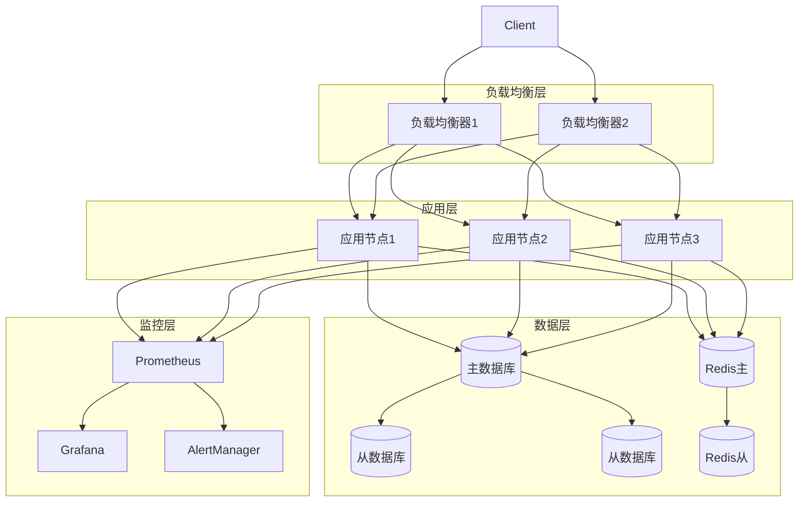

# 部署设计文档

## 1. 概述

本设计文档详细描述了分布式配置中心的部署架构、部署流程和配置管理，确保系统的可靠性和可维护性。

### 1.1 设计目标

- **高可用性：** 确保系统7*24小时稳定运行
- **可扩展性：** 支持水平扩展和垂直扩展
- **可维护性：** 简化部署和维护流程
- **安全性：** 保护系统配置和数据安全
- **监控性：** 提供完整的监控和告警机制

### 1.2 部署架构



## 2. 部署环境

### 2.1 硬件要求

```rust
#[derive(Debug, Clone)]
pub struct HardwareRequirements {
    pub cpu: CpuRequirements,
    pub memory: MemoryRequirements,
    pub disk: DiskRequirements,
    pub network: NetworkRequirements,
}

#[derive(Debug, Clone)]
pub struct CpuRequirements {
    pub cores: u32,
    pub threads: u32,
    pub frequency: f64,  // GHz
}

#[derive(Debug, Clone)]
pub struct MemoryRequirements {
    pub total: u64,      // GB
    pub swap: u64,       // GB
}

#[derive(Debug, Clone)]
pub struct DiskRequirements {
    pub total: u64,      // GB
    pub iops: u32,       // IOPS
    pub bandwidth: u64,  // MB/s
}

#[derive(Debug, Clone)]
pub struct NetworkRequirements {
    pub bandwidth: u64,  // Mbps
    pub latency: u32,    // ms
}
```

### 2.2 软件要求

```rust
#[derive(Debug, Clone)]
pub struct SoftwareRequirements {
    pub os: OsRequirements,
    pub runtime: RuntimeRequirements,
    pub dependencies: Vec<Dependency>,
}

#[derive(Debug, Clone)]
pub struct OsRequirements {
    pub name: String,
    pub version: String,
    pub architecture: String,
}

#[derive(Debug, Clone)]
pub struct RuntimeRequirements {
    pub rust_version: String,
    pub tokio_version: String,
    pub actix_version: String,
}

#[derive(Debug, Clone)]
pub struct Dependency {
    pub name: String,
    pub version: String,
    pub type_: DependencyType,
}

#[derive(Debug, Clone)]
pub enum DependencyType {
    Database,
    Cache,
    MessageQueue,
    Monitoring,
}
```

## 3. 部署配置

### 3.1 应用配置

```rust
#[derive(Debug, Clone)]
pub struct AppConfig {
    pub server: ServerConfig,
    pub database: DatabaseConfig,
    pub cache: CacheConfig,
    pub raft: RaftConfig,
    pub security: SecurityConfig,
    pub monitoring: MonitoringConfig,
}

#[derive(Debug, Clone)]
pub struct ServerConfig {
    pub host: String,
    pub port: u16,
    pub workers: u32,
    pub max_connections: u32,
    pub timeout: Duration,
}

#[derive(Debug, Clone)]
pub struct DatabaseConfig {
    pub host: String,
    pub port: u16,
    pub username: String,
    pub password: String,
    pub database: String,
    pub pool_size: u32,
    pub max_lifetime: Duration,
}

#[derive(Debug, Clone)]
pub struct CacheConfig {
    pub host: String,
    pub port: u16,
    pub password: String,
    pub pool_size: u32,
    pub key_prefix: String,
}

#[derive(Debug, Clone)]
pub struct RaftConfig {
    pub node_id: String,
    pub peers: Vec<String>,
    pub election_timeout: Duration,
    pub heartbeat_interval: Duration,
}

#[derive(Debug, Clone)]
pub struct SecurityConfig {
    pub jwt_secret: String,
    pub jwt_expiration: Duration,
    pub encryption_key: String,
}

#[derive(Debug, Clone)]
pub struct MonitoringConfig {
    pub prometheus_port: u16,
    pub metrics_path: String,
    pub alert_rules: Vec<AlertRule>,
}
```

### 3.2 环境变量

```rust
#[derive(Debug, Clone)]
pub struct EnvironmentVariables {
    pub app_env: String,
    pub log_level: String,
    pub config_path: String,
    pub data_dir: String,
    pub temp_dir: String,
}

impl EnvironmentVariables {
    pub fn load() -> Result<Self> {
        Ok(Self {
            app_env: std::env::var("APP_ENV")?,
            log_level: std::env::var("LOG_LEVEL")?,
            config_path: std::env::var("CONFIG_PATH")?,
            data_dir: std::env::var("DATA_DIR")?,
            temp_dir: std::env::var("TEMP_DIR")?,
        })
    }
}
```

## 4. 部署流程

### 4.1 部署脚本

```rust
#[derive(Debug, Clone)]
pub struct DeploymentScript {
    pub steps: Vec<DeploymentStep>,
}

#[derive(Debug, Clone)]
pub enum DeploymentStep {
    CheckEnvironment,
    InstallDependencies,
    BuildApplication,
    ConfigureServices,
    StartServices,
    VerifyDeployment,
    Rollback,
}

impl DeploymentScript {
    pub async fn execute(&self) -> Result<()> {
        for step in &self.steps {
            match step {
                DeploymentStep::CheckEnvironment => {
                    self.check_environment().await?;
                }
                DeploymentStep::InstallDependencies => {
                    self.install_dependencies().await?;
                }
                DeploymentStep::BuildApplication => {
                    self.build_application().await?;
                }
                DeploymentStep::ConfigureServices => {
                    self.configure_services().await?;
                }
                DeploymentStep::StartServices => {
                    self.start_services().await?;
                }
                DeploymentStep::VerifyDeployment => {
                    self.verify_deployment().await?;
                }
                DeploymentStep::Rollback => {
                    self.rollback().await?;
                }
            }
        }
        
        Ok(())
    }

    async fn check_environment(&self) -> Result<()> {
        // 检查系统要求
        self.check_system_requirements().await?;
        
        // 检查依赖服务
        self.check_dependency_services().await?;
        
        // 检查网络连接
        self.check_network_connectivity().await?;
        
        Ok(())
    }

    async fn install_dependencies(&self) -> Result<()> {
        // 安装系统依赖
        self.install_system_dependencies().await?;
        
        // 安装应用依赖
        self.install_application_dependencies().await?;
        
        // 配置依赖服务
        self.configure_dependency_services().await?;
        
        Ok(())
    }

    async fn build_application(&self) -> Result<()> {
        // 编译应用
        self.compile_application().await?;
        
        // 运行测试
        self.run_tests().await?;
        
        // 打包应用
        self.package_application().await?;
        
        Ok(())
    }

    async fn configure_services(&self) -> Result<()> {
        // 配置应用服务
        self.configure_app_service().await?;
        
        // 配置数据库
        self.configure_database().await?;
        
        // 配置缓存
        self.configure_cache().await?;
        
        // 配置监控
        self.configure_monitoring().await?;
        
        Ok(())
    }

    async fn start_services(&self) -> Result<()> {
        // 启动数据库
        self.start_database().await?;
        
        // 启动缓存
        self.start_cache().await?;
        
        // 启动应用
        self.start_application().await?;
        
        // 启动监控
        self.start_monitoring().await?;
        
        Ok(())
    }

    async fn verify_deployment(&self) -> Result<()> {
        // 检查服务状态
        self.check_service_status().await?;
        
        // 运行健康检查
        self.run_health_checks().await?;
        
        // 验证功能
        self.verify_functionality().await?;
        
        Ok(())
    }

    async fn rollback(&self) -> Result<()> {
        // 停止服务
        self.stop_services().await?;
        
        // 恢复配置
        self.restore_configuration().await?;
        
        // 恢复数据
        self.restore_data().await?;
        
        // 启动旧版本
        self.start_old_version().await?;
        
        Ok(())
    }
}
```

### 4.2 容器化部署

```rust
#[derive(Debug, Clone)]
pub struct DockerConfig {
    pub base_image: String,
    pub ports: Vec<PortMapping>,
    pub volumes: Vec<VolumeMapping>,
    pub environment: HashMap<String, String>,
    pub health_check: HealthCheck,
}

#[derive(Debug, Clone)]
pub struct PortMapping {
    pub container_port: u16,
    pub host_port: u16,
    pub protocol: String,
}

#[derive(Debug, Clone)]
pub struct VolumeMapping {
    pub host_path: String,
    pub container_path: String,
    pub read_only: bool,
}

#[derive(Debug, Clone)]
pub struct HealthCheck {
    pub command: Vec<String>,
    pub interval: Duration,
    pub timeout: Duration,
    pub retries: u32,
}

impl DockerConfig {
    pub fn generate_dockerfile(&self) -> String {
        format!(
            r#"
            FROM {}
            
            WORKDIR /app
            
            COPY target/release/config-center /app/
            COPY config/ /app/config/
            
            EXPOSE {}
            
            HEALTHCHECK --interval={}s --timeout={}s --retries={} \
                CMD {}
            
            ENTRYPOINT ["/app/config-center"]
            "#,
            self.base_image,
            self.ports.iter()
                .map(|p| p.container_port.to_string())
                .collect::<Vec<_>>()
                .join(" "),
            self.health_check.interval.as_secs(),
            self.health_check.timeout.as_secs(),
            self.health_check.retries,
            self.health_check.command.join(" ")
        )
    }
}
```

## 5. 监控和运维

### 5.1 监控配置

```rust
#[derive(Debug, Clone)]
pub struct MonitoringConfig {
    pub metrics: MetricsConfig,
    pub alerts: AlertsConfig,
    pub dashboards: DashboardsConfig,
}

#[derive(Debug, Clone)]
pub struct MetricsConfig {
    pub scrape_interval: Duration,
    pub retention_period: Duration,
    pub targets: Vec<String>,
}

#[derive(Debug, Clone)]
pub struct AlertsConfig {
    pub rules: Vec<AlertRule>,
    pub receivers: Vec<AlertReceiver>,
    pub routes: Vec<AlertRoute>,
}

#[derive(Debug, Clone)]
pub struct AlertRule {
    pub name: String,
    pub expr: String,
    pub duration: Duration,
    pub labels: HashMap<String, String>,
    pub annotations: HashMap<String, String>,
}

#[derive(Debug, Clone)]
pub struct AlertReceiver {
    pub name: String,
    pub type_: ReceiverType,
    pub config: HashMap<String, String>,
}

#[derive(Debug, Clone)]
pub enum ReceiverType {
    Email,
    Slack,
    Webhook,
    PagerDuty,
}

#[derive(Debug, Clone)]
pub struct AlertRoute {
    pub receiver: String,
    pub group_by: Vec<String>,
    pub group_wait: Duration,
    pub group_interval: Duration,
    pub repeat_interval: Duration,
}

#[derive(Debug, Clone)]
pub struct DashboardsConfig {
    pub templates: Vec<DashboardTemplate>,
    pub refresh_interval: Duration,
}

#[derive(Debug, Clone)]
pub struct DashboardTemplate {
    pub name: String,
    pub panels: Vec<Panel>,
}

#[derive(Debug, Clone)]
pub struct Panel {
    pub title: String,
    pub type_: PanelType,
    pub query: String,
    pub refresh: Duration,
}

#[derive(Debug, Clone)]
pub enum PanelType {
    Graph,
    Gauge,
    Table,
    Heatmap,
}
```

### 5.2 运维工具

```rust
#[derive(Debug, Clone)]
pub struct OpsTools {
    pub backup: BackupTool,
    pub restore: RestoreTool,
    pub maintenance: MaintenanceTool,
}

#[derive(Debug, Clone)]
pub struct BackupTool {
    pub schedule: Schedule,
    pub retention: RetentionPolicy,
    pub storage: StorageConfig,
}

#[derive(Debug, Clone)]
pub struct Schedule {
    pub cron: String,
    pub enabled: bool,
}

#[derive(Debug, Clone)]
pub struct RetentionPolicy {
    pub max_backups: u32,
    pub max_age: Duration,
}

#[derive(Debug, Clone)]
pub struct StorageConfig {
    pub type_: StorageType,
    pub path: String,
    pub credentials: HashMap<String, String>,
}

#[derive(Debug, Clone)]
pub enum StorageType {
    Local,
    S3,
    Azure,
    GCS,
}

impl OpsTools {
    pub async fn backup(&self) -> Result<()> {
        // 创建备份
        self.create_backup().await?;
        
        // 压缩备份
        self.compress_backup().await?;
        
        // 上传备份
        self.upload_backup().await?;
        
        // 清理旧备份
        self.cleanup_old_backups().await?;
        
        Ok(())
    }

    pub async fn restore(&self, backup_id: &str) -> Result<()> {
        // 下载备份
        self.download_backup(backup_id).await?;
        
        // 解压备份
        self.extract_backup().await?;
        
        // 验证备份
        self.verify_backup().await?;
        
        // 恢复数据
        self.restore_data().await?;
        
        Ok(())
    }

    pub async fn maintenance(&self) -> Result<()> {
        // 检查系统状态
        self.check_system_status().await?;
        
        // 优化数据库
        self.optimize_database().await?;
        
        // 清理临时文件
        self.cleanup_temp_files().await?;
        
        // 更新系统
        self.update_system().await?;
        
        Ok(())
    }
}
```

## 6. 总结

部署设计通过合理的架构设计、完善的配置管理和自动化的部署流程，确保了配置中心的可靠性和可维护性
