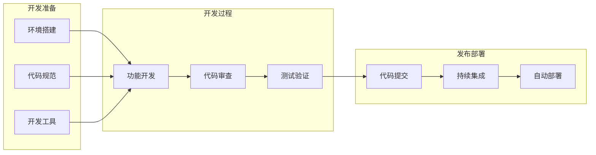

# 开发指南

## 1. 概述

本开发指南详细描述了如何参与分布式配置中心的开发工作，包括开发环境搭建、代码规范、提交规范等内容。

### 1.1 开发目标

- **高质量：** 确保代码质量和可维护性
- **高效率：** 提高开发效率和协作效率
- **可扩展：** 支持功能扩展和性能优化
- **可测试：** 支持单元测试和集成测试
- **可部署：** 支持自动化部署和持续集成

### 1.2 开发流程



## 2. 开发环境

### 2.1 环境要求

```markdown
# 开发环境要求

## 1. 基础环境

### 1.1 操作系统

- Linux (推荐 Ubuntu 20.04+)
- macOS (推荐 10.15+)
- Windows (推荐 Windows 10+)

### 1.2 开发工具

- Rust 1.70+
- Git 2.30+
- Docker 20.10+
- VS Code (推荐)

### 1.3 依赖服务

- PostgreSQL 12+
- Redis 6+
- Nginx 1.18+

## 2. 开发工具配置

### 2.1 Rust工具链

```bash
# 安装Rust
curl --proto '=https' --tlsv1.2 -sSf https://sh.rustup.rs | sh

# 安装组件
rustup component add rustfmt
rustup component add clippy
rustup target add wasm32-unknown-unknown
```

### 2.2 VS Code插件

- rust-analyzer
- CodeLLDB
- crates
- TOML
- YAML
- GitLens
- Docker

### 2.3 Git配置

```bash
# 配置用户信息
git config --global user.name "Your Name"
git config --global user.email "your.email@example.com"

# 配置编辑器
git config --global core.editor "code --wait"

# 配置换行符
git config --global core.autocrlf input  # Linux/macOS
git config --global core.autocrlf true   # Windows
```

## 3. 项目设置

### 3.1 克隆项目

```bash
# 克隆项目
git clone https://github.com/your-org/config-center.git

# 进入项目目录
cd config-center

# 安装依赖
cargo build
```

### 3.2 环境变量

```bash
# 创建环境变量文件
cp .env.example .env

# 编辑环境变量
vim .env
```

### 3.3 数据库设置

```bash
# 创建数据库
createdb config_center

# 运行迁移
cargo run --bin migrate
```

### 3.4 开发服务器

```bash
# 启动开发服务器
cargo run --bin dev
```

### 2.2 代码规范

```markdown
# 代码规范

## 1. Rust代码规范

### 1.1 命名规范

- 使用有意义的名称
- 使用驼峰命名法
- 使用下划线分隔单词
- 避免使用缩写

### 1.2 代码格式

- 使用rustfmt格式化代码
- 每行不超过100个字符
- 使用4个空格缩进
- 使用空行分隔逻辑块

### 1.3 注释规范

- 为公共API添加文档注释
- 为复杂逻辑添加行内注释
- 使用TODO标记待办事项
- 使用FIXME标记问题

### 1.4 错误处理

- 使用Result处理错误
- 使用自定义错误类型
- 提供有意义的错误信息
- 记录错误日志

## 2. 项目结构

### 2.1 目录结构

config-center/
├── src/                    # 源代码
│   ├── main.rs            # 程序入口
│   ├── lib.rs             # 库入口
│   ├── api/               # API模块
│   ├── config/            # 配置模块
│   ├── db/                # 数据库模块
│   ├── models/            # 数据模型
│   ├── services/          # 业务服务
│   └── utils/             # 工具函数
├── tests/                 # 测试代码
├── examples/              # 示例代码
├── docs/                  # 文档
├── scripts/               # 脚本
└── config/                # 配置文件

### 2.2 模块组织

- 按功能划分模块
- 保持模块独立性
- 避免循环依赖
- 合理使用可见性

### 2.3 依赖管理

- 指定依赖版本
- 使用workspace管理
- 避免重复依赖
- 定期更新依赖

## 3. 测试规范

### 3.1 单元测试

- 测试公共API
- 测试边界条件
- 测试错误情况
- 使用测试夹具

### 3.2 集成测试

- 测试模块交互
- 测试外部依赖
- 测试配置加载
- 测试错误处理

### 3.3 性能测试

- 测试响应时间
- 测试并发性能
- 测试资源使用
- 测试稳定性

## 4. 文档规范

### 4.1 代码文档

- 使用rustdoc注释
- 提供使用示例
- 说明参数和返回值
- 说明错误情况

### 4.2 项目文档

- 更新README
- 更新CHANGELOG
- 更新API文档
- 更新部署文档
```

### 2.3 开发工具

```markdown
# 开发工具

## 1. 代码编辑器

### 1.1 VS Code配置

```json
{
    "rust-analyzer.checkOnSave.command": "clippy",
    "rust-analyzer.rustfmt_extraArgs": ["+nightly"],
    "editor.formatOnSave": true,
    "editor.codeActionsOnSave": {
        "source.fixAll.rust-analyzer": true
    }
}
```

### 1.2 快捷键

- 格式化代码: `Shift + Alt + F`
- 运行测试: `Ctrl + Shift + T`
- 跳转定义: `F12`
- 查找引用: `Shift + F12`

## 2. 调试工具

### 2.1 LLDB配置

```json
{
    "version": "0.2.0",
    "configurations": [
        {
            "type": "lldb",
            "request": "launch",
            "name": "Debug",
            "cargo": {
                "args": ["build", "--bin=config-center"]
            },
            "args": [],
            "cwd": "${workspaceFolder}"
        }
    ]
}
```

### 2.2 调试技巧

- 设置断点
- 查看变量
- 单步执行
- 条件断点

## 3. 性能分析

### 3.1 性能分析工具

- perf
- valgrind
- cargo-flamegraph
- cargo-instruments

### 3.2 性能优化

- 使用性能分析
- 优化热点代码
- 减少内存分配
- 优化并发处理

## 3. 开发流程

### 3.1 功能开发

```markdown
# 功能开发流程

## 1. 需求分析

### 1.1 需求收集

- 理解业务需求
- 分析技术可行性
- 评估开发周期
- 确定优先级

### 1.2 方案设计

- 设计系统架构
- 设计数据模型
- 设计接口定义
- 设计测试方案

## 2. 编码实现

### 2.1 开发准备

- 创建功能分支
- 更新本地代码
- 准备测试环境
- 编写测试用例

### 2.2 编码规范

- 遵循代码规范
- 编写单元测试
- 添加注释文档
- 进行代码审查

### 2.3 测试验证

- 运行单元测试
- 运行集成测试
- 进行性能测试
- 进行安全测试

## 3. 代码审查

### 3.1 审查重点

- 代码质量
- 测试覆盖
- 性能影响
- 安全隐患

### 3.2 审查流程

- 提交审查请求
- 进行代码审查
- 修改反馈问题
- 确认合并代码

## 4. 发布部署

### 4.1 发布准备

- 更新版本号
- 更新文档
- 准备发布说明
- 准备回滚方案

### 4.2 部署流程

- 运行自动化测试
- 构建发布包
- 部署到测试环境
- 部署到生产环境
```

### 3.2 代码提交

```markdown
# 代码提交规范

## 1. 提交信息

### 1.1 格式规范

```plaintext
<type>(<scope>): <subject>

<body>

<footer>
```

### 1.2 类型说明

- feat: 新功能
- fix: 修复bug
- docs: 文档更新
- style: 代码格式
- refactor: 重构
- test: 测试
- chore: 构建

### 1.3 示例

```plaintext
feat(auth): add JWT authentication

- Add JWT token generation
- Add token validation
- Add refresh token support
- Add token revocation

Closes #123
```

## 2. 分支管理

### 2.1 分支策略

- main: 主分支
- develop: 开发分支
- feature/*: 功能分支
- bugfix/*: 修复分支
- release/*: 发布分支

### 2.2 工作流程

1. 从develop创建功能分支
2. 在功能分支开发
3. 提交到develop
4. 合并到main发布

## 3. 版本控制

### 3.1 版本号

- 主版本号: 不兼容的API修改
- 次版本号: 向下兼容的功能性新增
- 修订号: 向下兼容的问题修正

### 3.2 标签管理

- 创建版本标签
- 更新CHANGELOG
- 生成发布说明
- 归档发布包

### 3.3 持续集成

```markdown
# 持续集成

## 1. CI配置

### 1.1 GitHub Actions

```yaml
name: CI

on:
  push:
    branches: [ main, develop ]
  pull_request:
    branches: [ main, develop ]

jobs:
  build:
    runs-on: ubuntu-latest
    steps:
      - uses: actions/checkout@v2
      - uses: actions-rs/toolchain@v1
        with:
          toolchain: stable
          components: rustfmt, clippy
      - name: Build
        run: cargo build --verbose
      - name: Test
        run: cargo test --verbose
      - name: Lint
        run: cargo clippy -- -D warnings
      - name: Format
        run: cargo fmt -- --check
```

### 1.2 构建流程

- 检出代码
- 安装依赖
- 运行测试
- 代码检查
- 构建发布

## 2. 自动化测试

### 2.1 测试配置

```toml
[dev-dependencies]
tokio-test = "0.4"
mockall = "0.11"
test-log = "0.2"
```

### 2.2 测试类型

- 单元测试
- 集成测试
- 性能测试
- 压力测试

## 3. 部署流程

### 3.1 部署配置

```yaml
name: Deploy

on:
  push:
    branches: [ main ]

jobs:
  deploy:
    runs-on: ubuntu-latest
    steps:
      - uses: actions/checkout@v2
      - name: Build
        run: cargo build --release
      - name: Test
        run: cargo test
      - name: Deploy
        run: |
          scp target/release/config-center user@server:/usr/local/bin/
          ssh user@server "systemctl restart config-center"
```

### 3.2 部署环境

- 开发环境
- 测试环境
- 预发布环境
- 生产环境

## 4. 总结

开发指南通过详细的开发环境配置、代码规范、开发流程和持续集成说明，确保了开发团队能够高效协作，保持代码质量。
