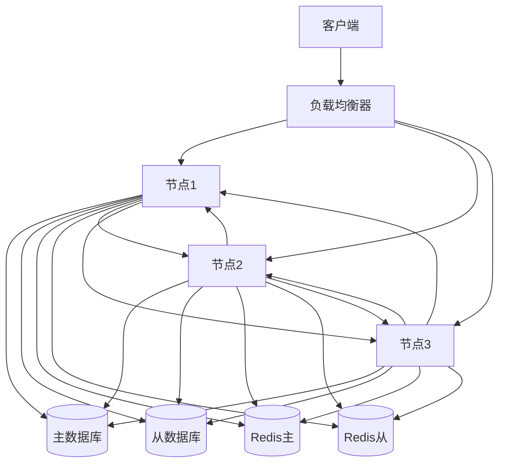

# 高可用性设计文档

## 1. 概述

本设计文档详细描述了分布式配置中心的高可用性设计方案，包括容错机制、故障转移、负载均衡等关键特性，确保系统在各种异常情况下仍能保持稳定运行。

### 1.1 设计目标

- **高可用性：** 系统可用性达到 99.999%
- **容错性：** 支持多节点故障
- **自动恢复：** 故障自动检测和恢复
- **数据一致性：** 确保数据在故障转移过程中保持一致
- **性能保证：** 在保证高可用的同时维持系统性能

### 1.2 核心组件

- **服务发现：** 节点注册与发现
- **负载均衡：** 请求分发与均衡
- **故障检测：** 健康检查与故障检测
- **故障转移：** 自动故障转移
- **数据同步：** 多节点数据同步

## 2. 架构设计

### 2.1 整体架构



### 2.2 节点角色

```rust
#[derive(Debug, Clone, Copy, PartialEq)]
pub enum NodeRole {
    Leader,     // 领导者节点
    Follower,   // 跟随者节点
    Candidate,  // 候选者节点
    Observer,   // 观察者节点
}

#[derive(Debug, Clone)]
pub struct NodeInfo {
    pub id: String,
    pub role: NodeRole,
    pub address: String,
    pub status: NodeStatus,
    pub last_heartbeat: DateTime<Utc>,
    pub metadata: HashMap<String, String>,
}

#[derive(Debug, Clone, Copy, PartialEq)]
pub enum NodeStatus {
    Healthy,    // 健康
    Degraded,   // 降级
    Failed,     // 故障
    ShuttingDown, // 关闭中
}
```

## 3. 服务发现

### 3.1 节点注册

```rust
pub struct ServiceRegistry {
    db: Arc<Database>,
    cache: Arc<Redis>,
    heartbeat_interval: Duration,
}

impl ServiceRegistry {
    pub async fn register(&self, node: NodeInfo) -> Result<()> {
        // 注册节点信息
        self.db.insert_node(&node).await?;
        
        // 更新缓存
        self.cache.set(
            &format!("node:{}", node.id),
            &node,
            Some(self.heartbeat_interval),
        ).await?;

        Ok(())
    }

    pub async fn heartbeat(&self, node_id: &str) -> Result<()> {
        // 更新心跳时间
        self.db.update_heartbeat(node_id).await?;
        
        // 更新缓存
        self.cache.set(
            &format!("node:{}:heartbeat", node_id),
            &Utc::now(),
            Some(self.heartbeat_interval),
        ).await?;

        Ok(())
    }
}
```

### 3.2 节点发现

```rust
impl ServiceRegistry {
    pub async fn get_healthy_nodes(&self) -> Result<Vec<NodeInfo>> {
        // 从缓存获取健康节点
        let nodes = self.cache.get_pattern("node:*").await?;
        
        // 过滤健康节点
        let healthy_nodes = nodes
            .into_iter()
            .filter(|node| node.status == NodeStatus::Healthy)
            .collect();

        Ok(healthy_nodes)
    }

    pub async fn get_node(&self, node_id: &str) -> Result<Option<NodeInfo>> {
        // 从缓存获取节点信息
        if let Some(node) = self.cache.get(&format!("node:{}", node_id)).await? {
            return Ok(Some(node));
        }

        // 从数据库获取节点信息
        self.db.get_node(node_id).await
    }
}
```

## 4. 负载均衡

### 4.1 负载均衡策略

```rust
#[derive(Debug, Clone)]
pub enum LoadBalanceStrategy {
    RoundRobin,     // 轮询
    LeastConn,      // 最少连接
    WeightedRoundRobin, // 加权轮询
    ConsistentHash, // 一致性哈希
}

pub struct LoadBalancer {
    strategy: LoadBalanceStrategy,
    nodes: Arc<RwLock<Vec<NodeInfo>>>,
    weights: HashMap<String, u32>,
}

impl LoadBalancer {
    pub fn select_node(&self, request: &Request) -> Result<NodeInfo> {
        match self.strategy {
            LoadBalanceStrategy::RoundRobin => self.round_robin(),
            LoadBalanceStrategy::LeastConn => self.least_conn(),
            LoadBalanceStrategy::WeightedRoundRobin => self.weighted_round_robin(),
            LoadBalanceStrategy::ConsistentHash => self.consistent_hash(request),
        }
    }

    fn round_robin(&self) -> Result<NodeInfo> {
        let nodes = self.nodes.read().await;
        if nodes.is_empty() {
            return Err(Error::NoAvailableNodes);
        }
        
        // 实现轮询逻辑
        Ok(nodes[0].clone())
    }

    fn least_conn(&self) -> Result<NodeInfo> {
        let nodes = self.nodes.read().await;
        if nodes.is_empty() {
            return Err(Error::NoAvailableNodes);
        }
        
        // 实现最少连接逻辑
        Ok(nodes[0].clone())
    }

    fn weighted_round_robin(&self) -> Result<NodeInfo> {
        let nodes = self.nodes.read().await;
        if nodes.is_empty() {
            return Err(Error::NoAvailableNodes);
        }
        
        // 实现加权轮询逻辑
        Ok(nodes[0].clone())
    }

    fn consistent_hash(&self, request: &Request) -> Result<NodeInfo> {
        let nodes = self.nodes.read().await;
        if nodes.is_empty() {
            return Err(Error::NoAvailableNodes);
        }
        
        // 实现一致性哈希逻辑
        Ok(nodes[0].clone())
    }
}
```

### 4.2 健康检查

```rust
pub struct HealthChecker {
    check_interval: Duration,
    timeout: Duration,
    failure_threshold: u32,
    success_threshold: u32,
}

impl HealthChecker {
    pub async fn check_node(&self, node: &NodeInfo) -> Result<bool> {
        let start = Instant::now();
        
        // 执行健康检查
        let is_healthy = self.perform_health_check(node).await?;
        
        // 记录检查结果
        self.record_check_result(node.id, is_healthy).await?;
        
        // 判断节点状态
        let status = self.determine_node_status(node.id).await?;
        
        Ok(status == NodeStatus::Healthy)
    }

    async fn perform_health_check(&self, node: &NodeInfo) -> Result<bool> {
        // 实现具体的健康检查逻辑
        let client = reqwest::Client::new();
        let response = client
            .get(&format!("{}/health", node.address))
            .timeout(self.timeout)
            .send()
            .await?;
            
        Ok(response.status().is_success())
    }

    async fn record_check_result(&self, node_id: &str, is_healthy: bool) -> Result<()> {
        // 记录检查结果
        let result = HealthCheckResult {
            node_id: node_id.to_string(),
            timestamp: Utc::now(),
            is_healthy,
        };
        
        // 保存到数据库
        self.db.insert_health_check_result(&result).await?;
        
        Ok(())
    }

    async fn determine_node_status(&self, node_id: &str) -> Result<NodeStatus> {
        // 获取最近的检查结果
        let results = self.db.get_recent_health_checks(node_id).await?;
        
        // 分析检查结果
        let failure_count = results.iter()
            .filter(|r| !r.is_healthy)
            .count();
            
        let success_count = results.iter()
            .filter(|r| r.is_healthy)
            .count();
            
        // 判断节点状态
        if failure_count >= self.failure_threshold as usize {
            Ok(NodeStatus::Failed)
        } else if success_count >= self.success_threshold as usize {
            Ok(NodeStatus::Healthy)
        } else {
            Ok(NodeStatus::Degraded)
        }
    }
}
```

## 5. 故障转移

### 5.1 故障检测

```rust
pub struct FailureDetector {
    check_interval: Duration,
    timeout: Duration,
    failure_threshold: u32,
    recovery_threshold: u32,
}

impl FailureDetector {
    pub async fn start_detection(&self) {
        let mut interval = tokio::time::interval(self.check_interval);
        
        loop {
            interval.tick().await;
            
            // 获取所有节点
            let nodes = self.get_all_nodes().await?;
            
            // 检查每个节点
            for node in nodes {
                if let Err(e) = self.check_node(&node).await {
                    error!("Failed to check node {}: {}", node.id, e);
                }
            }
        }
    }

    async fn check_node(&self, node: &NodeInfo) -> Result<()> {
        let start = Instant::now();
        
        // 执行故障检测
        let is_alive = self.perform_failure_check(node).await?;
        
        // 更新节点状态
        self.update_node_status(node.id, is_alive).await?;
        
        // 如果节点故障，触发故障转移
        if !is_alive {
            self.trigger_failover(node.id).await?;
        }
        
        Ok(())
    }

    async fn perform_failure_check(&self, node: &NodeInfo) -> Result<bool> {
        // 实现具体的故障检测逻辑
        let client = reqwest::Client::new();
        let response = client
            .get(&format!("{}/ping", node.address))
            .timeout(self.timeout)
            .send()
            .await?;
            
        Ok(response.status().is_success())
    }

    async fn update_node_status(&self, node_id: &str, is_alive: bool) -> Result<()> {
        // 更新节点状态
        let status = if is_alive {
            NodeStatus::Healthy
        } else {
            NodeStatus::Failed
        };
        
        self.db.update_node_status(node_id, status).await?;
        
        Ok(())
    }

    async fn trigger_failover(&self, node_id: &str) -> Result<()> {
        // 获取节点角色
        let node = self.db.get_node(node_id).await?;
        
        match node.role {
            NodeRole::Leader => self.handle_leader_failure(node_id).await?,
            NodeRole::Follower => self.handle_follower_failure(node_id).await?,
            _ => {}
        }
        
        Ok(())
    }

    async fn handle_leader_failure(&self, node_id: &str) -> Result<()> {
        // 触发领导者选举
        self.start_leader_election().await?;
        
        Ok(())
    }

    async fn handle_follower_failure(&self, node_id: &str) -> Result<()> {
        // 从集群中移除故障节点
        self.remove_failed_node(node_id).await?;
        
        Ok(())
    }
}
```

### 5.2 故障恢复

```rust
pub struct FailureRecovery {
    recovery_timeout: Duration,
    max_retries: u32,
    retry_interval: Duration,
}

impl FailureRecovery {
    pub async fn recover_node(&self, node_id: &str) -> Result<()> {
        let mut retries = 0;
        
        while retries < self.max_retries {
            // 尝试恢复节点
            if self.try_recover_node(node_id).await? {
                return Ok(());
            }
            
            // 等待后重试
            tokio::time::sleep(self.retry_interval).await;
            retries += 1;
        }
        
        Err(Error::RecoveryTimeout)
    }

    async fn try_recover_node(&self, node_id: &str) -> Result<bool> {
        // 获取节点信息
        let node = self.db.get_node(node_id).await?;
        
        // 执行恢复步骤
        self.restart_node(&node).await?;
        
        // 验证节点状态
        let is_healthy = self.verify_node_health(&node).await?;
        
        if is_healthy {
            // 重新加入集群
            self.rejoin_cluster(&node).await?;
        }
        
        Ok(is_healthy)
    }

    async fn restart_node(&self, node: &NodeInfo) -> Result<()> {
        // 实现节点重启逻辑
        let client = reqwest::Client::new();
        client
            .post(&format!("{}/restart", node.address))
            .send()
            .await?;
            
        Ok(())
    }

    async fn verify_node_health(&self, node: &NodeInfo) -> Result<bool> {
        // 验证节点健康状态
        let client = reqwest::Client::new();
        let response = client
            .get(&format!("{}/health", node.address))
            .send()
            .await?;
            
        Ok(response.status().is_success())
    }

    async fn rejoin_cluster(&self, node: &NodeInfo) -> Result<()> {
        // 重新加入集群
        self.db.update_node_status(node.id, NodeStatus::Healthy).await?;
        
        // 同步数据
        self.sync_node_data(node).await?;
        
        Ok(())
    }
}
```

## 6. 数据一致性

### 6.1 数据同步

```rust
pub struct DataSynchronizer {
    sync_interval: Duration,
    batch_size: usize,
    max_lag: Duration,
}

impl DataSynchronizer {
    pub async fn start_sync(&self) {
        let mut interval = tokio::time::interval(self.sync_interval);
        
        loop {
            interval.tick().await;
            
            // 获取需要同步的节点
            let nodes = self.get_nodes_needing_sync().await?;
            
            // 同步每个节点
            for node in nodes {
                if let Err(e) = self.sync_node(&node).await {
                    error!("Failed to sync node {}: {}", node.id, e);
                }
            }
        }
    }

    async fn sync_node(&self, node: &NodeInfo) -> Result<()> {
        // 获取节点数据版本
        let node_version = self.get_node_version(node.id).await?;
        
        // 获取主节点数据版本
        let master_version = self.get_master_version().await?;
        
        // 如果版本不一致，进行同步
        if node_version != master_version {
            self.perform_sync(node, node_version, master_version).await?;
        }
        
        Ok(())
    }

    async fn perform_sync(&self, node: &NodeInfo, from_version: u64, to_version: u64) -> Result<()> {
        // 获取需要同步的数据
        let changes = self.get_changes(from_version, to_version).await?;
        
        // 分批同步数据
        for chunk in changes.chunks(self.batch_size) {
            self.sync_chunk(node, chunk).await?;
        }
        
        // 更新节点版本
        self.update_node_version(node.id, to_version).await?;
        
        Ok(())
    }

    async fn sync_chunk(&self, node: &NodeInfo, changes: &[Change]) -> Result<()> {
        // 实现数据同步逻辑
        let client = reqwest::Client::new();
        client
            .post(&format!("{}/sync", node.address))
            .json(changes)
            .send()
            .await?;
            
        Ok(())
    }
}
```

### 6.2 一致性检查

```rust
pub struct ConsistencyChecker {
    check_interval: Duration,
    max_inconsistencies: u32,
}

impl ConsistencyChecker {
    pub async fn start_check(&self) {
        let mut interval = tokio::time::interval(self.check_interval);
        
        loop {
            interval.tick().await;
            
            // 获取所有节点
            let nodes = self.get_all_nodes().await?;
            
            // 检查节点间的一致性
            if let Err(e) = self.check_consistency(&nodes).await {
                error!("Consistency check failed: {}", e);
            }
        }
    }

    async fn check_consistency(&self, nodes: &[NodeInfo]) -> Result<()> {
        // 获取主节点数据
        let master_data = self.get_master_data().await?;
        
        // 检查每个节点
        for node in nodes {
            let node_data = self.get_node_data(node.id).await?;
            
            // 比较数据
            let inconsistencies = self.compare_data(&master_data, &node_data)?;
            
            // 如果存在不一致，进行修复
            if !inconsistencies.is_empty() {
                self.repair_inconsistencies(node.id, &inconsistencies).await?;
            }
        }
        
        Ok(())
    }

    async fn repair_inconsistencies(&self, node_id: &str, inconsistencies: &[Inconsistency]) -> Result<()> {
        // 实现数据修复逻辑
        for inconsistency in inconsistencies {
            match inconsistency.type_ {
                InconsistencyType::Missing => {
                    self.repair_missing_data(node_id, &inconsistency).await?;
                }
                InconsistencyType::Mismatch => {
                    self.repair_mismatched_data(node_id, &inconsistency).await?;
                }
                InconsistencyType::Extra => {
                    self.repair_extra_data(node_id, &inconsistency).await?;
                }
            }
        }
        
        Ok(())
    }
}
```

## 7. 性能优化

### 7.1 缓存优化

```rust
pub struct CacheOptimizer {
    cache: Arc<Redis>,
    ttl: Duration,
    max_size: usize,
}

impl CacheOptimizer {
    pub async fn optimize(&self) -> Result<()> {
        // 清理过期缓存
        self.cleanup_expired_cache().await?;
        
        // 优化缓存大小
        self.optimize_cache_size().await?;
        
        // 预热热点数据
        self.warmup_hot_data().await?;
        
        Ok(())
    }

    async fn cleanup_expired_cache(&self) -> Result<()> {
        // 实现缓存清理逻辑
        self.cache.cleanup_expired().await?;
        
        Ok(())
    }

    async fn optimize_cache_size(&self) -> Result<()> {
        // 获取缓存大小
        let size = self.cache.size().await?;
        
        // 如果超过最大大小，清理旧数据
        if size > self.max_size {
            self.cache.evict_oldest().await?;
        }
        
        Ok(())
    }

    async fn warmup_hot_data(&self) -> Result<()> {
        // 获取热点数据
        let hot_data = self.get_hot_data().await?;
        
        // 预热缓存
        for (key, value) in hot_data {
            self.cache.set(&key, &value, Some(self.ttl)).await?;
        }
        
        Ok(())
    }
}
```

### 7.2 连接池优化

```rust
pub struct ConnectionPool {
    pool: Arc<Pool>,
    max_size: u32,
    min_size: u32,
    idle_timeout: Duration,
}

impl ConnectionPool {
    pub async fn optimize(&self) -> Result<()> {
        // 清理空闲连接
        self.cleanup_idle_connections().await?;
        
        // 调整连接池大小
        self.adjust_pool_size().await?;
        
        // 检查连接健康状态
        self.check_connection_health().await?;
        
        Ok(())
    }

    async fn cleanup_idle_connections(&self) -> Result<()> {
        // 实现空闲连接清理逻辑
        self.pool.cleanup_idle(self.idle_timeout).await?;
        
        Ok(())
    }

    async fn adjust_pool_size(&self) -> Result<()> {
        // 获取当前连接数
        let current_size = self.pool.size().await?;
        
        // 根据负载调整连接池大小
        if current_size > self.max_size {
            self.pool.resize(self.max_size).await?;
        } else if current_size < self.min_size {
            self.pool.resize(self.min_size).await?;
        }
        
        Ok(())
    }

    async fn check_connection_health(&self) -> Result<()> {
        // 检查连接健康状态
        self.pool.check_health().await?;
        
        Ok(())
    }
}
```

## 8. 监控告警

### 8.1 系统监控

```rust
pub struct SystemMonitor {
    metrics: Arc<Metrics>,
    alert_thresholds: HashMap<String, f64>,
}

impl SystemMonitor {
    pub async fn monitor(&self) -> Result<()> {
        // 收集系统指标
        let metrics = self.collect_metrics().await?;
        
        // 检查告警阈值
        self.check_alert_thresholds(&metrics).await?;
        
        // 更新监控面板
        self.update_dashboard(&metrics).await?;
        
        Ok(())
    }

    async fn collect_metrics(&self) -> Result<HashMap<String, f64>> {
        let mut metrics = HashMap::new();
        
        // 收集CPU使用率
        metrics.insert("cpu_usage".to_string(), self.get_cpu_usage().await?);
        
        // 收集内存使用率
        metrics.insert("memory_usage".to_string(), self.get_memory_usage().await?);
        
        // 收集磁盘使用率
        metrics.insert("disk_usage".to_string(), self.get_disk_usage().await?);
        
        // 收集网络流量
        metrics.insert("network_traffic".to_string(), self.get_network_traffic().await?);
        
        Ok(metrics)
    }

    async fn check_alert_thresholds(&self, metrics: &HashMap<String, f64>) -> Result<()> {
        for (metric, value) in metrics {
            if let Some(threshold) = self.alert_thresholds.get(metric) {
                if value > threshold {
                    self.send_alert(metric, *value, *threshold).await?;
                }
            }
        }
        
        Ok(())
    }

    async fn send_alert(&self, metric: &str, value: f64, threshold: f64) -> Result<()> {
        // 实现告警发送逻辑
        let alert = Alert {
            metric: metric.to_string(),
            value,
            threshold,
            timestamp: Utc::now(),
        };
        
        self.send_alert_notification(&alert).await?;
        
        Ok(())
    }
}
```

### 8.2 业务监控

```rust
pub struct BusinessMonitor {
    metrics: Arc<Metrics>,
    alert_rules: Vec<AlertRule>,
}

impl BusinessMonitor {
    pub async fn monitor(&self) -> Result<()> {
        // 收集业务指标
        let metrics = self.collect_business_metrics().await?;
        
        // 检查告警规则
        self.check_alert_rules(&metrics).await?;
        
        // 更新业务面板
        self.update_business_dashboard(&metrics).await?;
        
        Ok(())
    }

    async fn collect_business_metrics(&self) -> Result<HashMap<String, f64>> {
        let mut metrics = HashMap::new();
        
        // 收集请求量
        metrics.insert("request_count".to_string(), self.get_request_count().await?);
        
        // 收集响应时间
        metrics.insert("response_time".to_string(), self.get_response_time().await?);
        
        // 收集错误率
        metrics.insert("error_rate".to_string(), self.get_error_rate().await?);
        
        // 收集配置变更次数
        metrics.insert("config_changes".to_string(), self.get_config_changes().await?);
        
        Ok(metrics)
    }

    async fn check_alert_rules(&self, metrics: &HashMap<String, f64>) -> Result<()> {
        for rule in &self.alert_rules {
            if let Some(value) = metrics.get(&rule.metric) {
                if rule.check(*value) {
                    self.send_business_alert(rule, *value).await?;
                }
            }
        }
        
        Ok(())
    }

    async fn send_business_alert(&self, rule: &AlertRule, value: f64) -> Result<()> {
        // 实现业务告警发送逻辑
        let alert = BusinessAlert {
            rule: rule.clone(),
            value,
            timestamp: Utc::now(),
        };
        
        self.send_business_alert_notification(&alert).await?;
        
        Ok(())
    }
}
```

## 9. 总结

高可用性设计通过服务发现、负载均衡、故障转移、数据一致性、性能优化和监控告警等机制，确保了配置中心在各种异常情况下仍能保持稳定运行，提供了高可用性和可靠性的服务。
