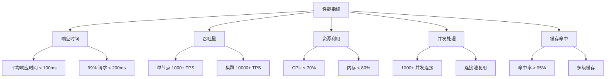

# 性能优化设计文档

## 1. 概述

本设计文档详细描述了分布式配置中心的性能优化策略，包括缓存优化、数据库优化、并发处理优化、网络传输优化和内存使用优化等方面。

### 1.1 优化目标

- **响应时间：** 接口平均响应时间 < 100ms，99% 请求响应时间 < 200ms
- **吞吐量：** 单节点支持 1000+ TPS
- **资源利用：** CPU 利用率 < 70%，内存使用率 < 80%
- **并发处理：** 支持 1000+ 并发连接
- **缓存命中：** 缓存命中率 > 95%

### 1.2 性能指标



## 2. 缓存优化

### 2.1 多级缓存策略


#### 2.1.1 本地缓存

```rust
use dashmap::DashMap;
use std::time::Duration;

pub struct LocalCache {
    cache: DashMap<String, CacheEntry>,
    ttl: Duration,
}

struct CacheEntry {
    value: String,
    expire_at: Instant,
}

impl LocalCache {
    pub fn new(ttl: Duration) -> Self {
        Self {
            cache: DashMap::new(),
            ttl,
        }
    }

    pub fn get(&self, key: &str) -> Option<String> {
        if let Some(entry) = self.cache.get(key) {
            if entry.expire_at > Instant::now() {
                Some(entry.value.clone())
            } else {
                self.cache.remove(key);
                None
            }
        } else {
            None
        }
    }

    pub fn set(&self, key: String, value: String) {
        let entry = CacheEntry {
            value,
            expire_at: Instant::now() + self.ttl,
        };
        self.cache.insert(key, entry);
    }
}
```

#### 2.1.2 Redis缓存

```rust
use redis::{Client, Connection};
use serde::{Deserialize, Serialize};

pub struct RedisCache {
    client: Client,
}

impl RedisCache {
    pub fn new(redis_url: &str) -> Result<Self, RedisError> {
        let client = Client::open(redis_url)?;
        Ok(Self { client })
    }

    pub async fn get(&self, key: &str) -> Result<Option<String>, RedisError> {
        let mut conn = self.client.get_async_connection().await?;
        redis::cmd("GET")
            .arg(key)
            .query_async(&mut conn)
            .await
    }

    pub async fn set(&self, key: &str, value: &str, ttl: u64) -> Result<(), RedisError> {
        let mut conn = self.client.get_async_connection().await?;
        redis::cmd("SET")
            .arg(key)
            .arg(value)
            .arg("EX")
            .arg(ttl)
            .query_async(&mut conn)
            .await
    }
}
```

### 2.2 缓存预热

```rust
pub struct CacheWarmer {
    local_cache: Arc<LocalCache>,
    redis_cache: Arc<RedisCache>,
    db: Arc<Database>,
}

impl CacheWarmer {
    pub async fn warm_up(&self) -> Result<(), Error> {
        // 1. 从数据库加载热点配置
        let hot_configs = self.db.get_hot_configs().await?;
        
        // 2. 批量写入Redis
        let mut pipe = redis::pipe();
        for config in &hot_configs {
            pipe.cmd("SET")
                .arg(&config.key)
                .arg(&config.value)
                .arg("EX")
                .arg(3600);
        }
        self.redis_cache.execute_pipeline(pipe).await?;
        
        // 3. 更新本地缓存
        for config in hot_configs {
            self.local_cache.set(config.key, config.value);
        }
        
        Ok(())
    }
}
```

### 2.3 缓存更新策略

```rust
pub enum CacheUpdateStrategy {
    WriteThrough,    // 同步更新
    WriteBehind,     // 异步更新
    WriteAround,     // 绕过缓存
}

impl CacheManager {
    pub async fn update_cache(
        &self,
        key: &str,
        value: &str,
        strategy: CacheUpdateStrategy,
    ) -> Result<(), Error> {
        match strategy {
            CacheUpdateStrategy::WriteThrough => {
                // 同步更新数据库和缓存
                self.db.update(key, value).await?;
                self.redis_cache.set(key, value, 3600).await?;
                self.local_cache.set(key.to_string(), value.to_string());
            }
            CacheUpdateStrategy::WriteBehind => {
                // 先更新缓存，异步更新数据库
                self.redis_cache.set(key, value, 3600).await?;
                self.local_cache.set(key.to_string(), value.to_string());
                self.async_update_db(key, value).await?;
            }
            CacheUpdateStrategy::WriteAround => {
                // 直接更新数据库，使缓存失效
                self.db.update(key, value).await?;
                self.invalidate_cache(key).await?;
            }
        }
        Ok(())
    }
}
```

## 3. 数据库优化

### 3.1 查询优化

```rust
pub struct QueryOptimizer {
    db: Arc<Database>,
}

impl QueryOptimizer {
    // 1. 索引优化
    pub async fn create_indexes(&self) -> Result<(), Error> {
        self.db.execute("
            CREATE INDEX IF NOT EXISTS idx_config_key ON config(key);
            CREATE INDEX IF NOT EXISTS idx_config_namespace ON config(namespace_id);
            CREATE INDEX IF NOT EXISTS idx_config_version ON config_version(config_id);
        ").await
    }

    // 2. 查询重写
    pub async fn optimize_query(&self, query: &str) -> Result<String, Error> {
        // 分析查询计划
        let plan = self.db.explain(query).await?;
        
        // 根据计划优化查询
        let optimized = match plan.operation {
            Operation::SeqScan => self.rewrite_seq_scan(query),
            Operation::IndexScan => query.to_string(),
            Operation::NestedLoop => self.rewrite_nested_loop(query),
        };
        
        Ok(optimized)
    }

    // 3. 批量操作
    pub async fn batch_update(&self, updates: Vec<ConfigUpdate>) -> Result<(), Error> {
        let mut tx = self.db.begin_transaction().await?;
        
        for update in updates {
            tx.execute(
                "UPDATE config SET value = $1 WHERE key = $2",
                &[&update.value, &update.key],
            ).await?;
        }
        
        tx.commit().await
    }
}
```

### 3.2 连接池优化

```rust
use deadpool_postgres::{Config, Pool};

pub struct DatabasePool {
    pool: Pool,
}

impl DatabasePool {
    pub fn new(config: Config) -> Result<Self, Error> {
        let pool = config.create_pool(None, NoTls)?;
        Ok(Self { pool })
    }

    pub async fn get_connection(&self) -> Result<PooledClient, Error> {
        self.pool.get().await
    }

    pub async fn execute_with_retry<F, T>(
        &self,
        f: F,
        max_retries: u32,
    ) -> Result<T, Error>
    where
        F: Fn(&Client) -> Future<Output = Result<T, Error>>,
    {
        let mut retries = 0;
        loop {
            let client = self.get_connection().await?;
            match f(&client).await {
                Ok(result) => return Ok(result),
                Err(e) if retries < max_retries => {
                    retries += 1;
                    tokio::time::sleep(Duration::from_millis(100 * retries)).await;
                }
                Err(e) => return Err(e),
            }
        }
    }
}
```

## 4. 并发处理优化

### 4.1 异步处理

```rust
use tokio::sync::Semaphore;
use std::sync::Arc;

pub struct AsyncProcessor {
    semaphore: Arc<Semaphore>,
    runtime: Runtime,
}

impl AsyncProcessor {
    pub fn new(max_concurrent: usize) -> Self {
        Self {
            semaphore: Arc::new(Semaphore::new(max_concurrent)),
            runtime: Runtime::new().unwrap(),
        }
    }

    pub async fn process<T, F>(&self, f: F) -> Result<T, Error>
    where
        F: Future<Output = Result<T, Error>>,
    {
        let _permit = self.semaphore.acquire().await?;
        f.await
    }

    pub async fn batch_process<T, F>(
        &self,
        items: Vec<T>,
        f: F,
    ) -> Result<Vec<T>, Error>
    where
        F: Fn(T) -> Future<Output = Result<T, Error>>,
    {
        let futures = items.into_iter().map(|item| self.process(f(item)));
        futures::future::join_all(futures).await.into_iter().collect()
    }
}
```

### 4.2 限流控制

```rust
use governor::{
    clock::DefaultClock,
    middleware::StateInformationMiddleware,
    state::{InMemoryState, NotKeyed},
    Quota,
    RateLimiter,
};

pub struct RateLimiter {
    limiter: RateLimiter<NotKeyed, InMemoryState, DefaultClock, StateInformationMiddleware>,
}

impl RateLimiter {
    pub fn new(quota: Quota) -> Self {
        Self {
            limiter: RateLimiter::direct(quota),
        }
    }

    pub async fn check_rate_limit(&self) -> Result<(), Error> {
        self.limiter.check().map_err(|e| Error::RateLimitExceeded)
    }
}
```

## 5. 网络传输优化

### 5.1 压缩传输

```rust
use flate2::write::GzEncoder;
use flate2::read::GzDecoder;
use std::io::{Read, Write};

pub struct Compression {
    level: u32,
}

impl Compression {
    pub fn new(level: u32) -> Self {
        Self { level }
    }

    pub fn compress(&self, data: &[u8]) -> Result<Vec<u8>, Error> {
        let mut encoder = GzEncoder::new(Vec::new(), self.level.into());
        encoder.write_all(data)?;
        Ok(encoder.finish()?)
    }

    pub fn decompress(&self, data: &[u8]) -> Result<Vec<u8>, Error> {
        let mut decoder = GzDecoder::new(data);
        let mut result = Vec::new();
        decoder.read_to_end(&mut result)?;
        Ok(result)
    }
}
```

### 5.2 批量传输

```rust
pub struct BatchTransfer {
    batch_size: usize,
    timeout: Duration,
}

impl BatchTransfer {
    pub async fn send_batch<T>(
        &self,
        items: Vec<T>,
        sender: &Sender<T>,
    ) -> Result<(), Error> {
        let mut batch = Vec::with_capacity(self.batch_size);
        
        for item in items {
            batch.push(item);
            if batch.len() >= self.batch_size {
                self.send_single_batch(&batch, sender).await?;
                batch.clear();
            }
        }
        
        if !batch.is_empty() {
            self.send_single_batch(&batch, sender).await?;
        }
        
        Ok(())
    }

    async fn send_single_batch<T>(
        &self,
        batch: &[T],
        sender: &Sender<T>,
    ) -> Result<(), Error> {
        tokio::time::timeout(self.timeout, async {
            for item in batch {
                sender.send(item.clone()).await?;
            }
            Ok(())
        })
        .await?
    }
}
```

## 6. 内存使用优化

### 6.1 内存池

```rust
use typed_arena::Arena;

pub struct MemoryPool<T> {
    arena: Arena<T>,
}

impl<T> MemoryPool<T> {
    pub fn new() -> Self {
        Self {
            arena: Arena::new(),
        }
    }

    pub fn allocate(&self, value: T) -> &T {
        self.arena.alloc(value)
    }

    pub fn clear(&mut self) {
        self.arena.clear();
    }
}
```

### 6.2 内存监控

```rust
use sysinfo::{System, SystemExt, ProcessExt};

pub struct MemoryMonitor {
    sys: System,
}

impl MemoryMonitor {
    pub fn new() -> Self {
        Self {
            sys: System::new_all(),
        }
    }

    pub fn get_memory_usage(&mut self) -> u64 {
        self.sys.refresh_all();
        self.sys.used_memory()
    }

    pub fn check_memory_threshold(&mut self, threshold: u64) -> bool {
        self.get_memory_usage() > threshold
    }
}
```

## 7. 性能监控

### 7.1 指标收集

```rust
use prometheus::{Counter, Histogram, Registry};

pub struct Metrics {
    request_counter: Counter,
    response_time: Histogram,
    error_counter: Counter,
    cache_hits: Counter,
    cache_misses: Counter,
}

impl Metrics {
    pub fn new(registry: &Registry) -> Result<Self, Error> {
        let request_counter = Counter::new(
            "config_center_requests_total",
            "Total number of requests",
        )?;
        
        let response_time = Histogram::with_opts(
            HistogramOpts::new(
                "config_center_response_time_seconds",
                "Response time in seconds",
            )
            .buckets(vec![0.1, 0.5, 1.0, 2.0, 5.0]),
        )?;
        
        registry.register(Box::new(request_counter.clone()))?;
        registry.register(Box::new(response_time.clone()))?;
        
        Ok(Self {
            request_counter,
            response_time,
            error_counter: Counter::new(
                "config_center_errors_total",
                "Total number of errors",
            )?,
            cache_hits: Counter::new(
                "config_center_cache_hits_total",
                "Total number of cache hits",
            )?,
            cache_misses: Counter::new(
                "config_center_cache_misses_total",
                "Total number of cache misses",
            )?,
        })
    }
}
```

### 7.2 性能分析

```rust
pub struct PerformanceAnalyzer {
    metrics: Arc<Metrics>,
}

impl PerformanceAnalyzer {
    pub async fn analyze_performance(&self) -> Result<PerformanceReport, Error> {
        let report = PerformanceReport {
            request_rate: self.calculate_request_rate().await?,
            average_response_time: self.calculate_average_response_time().await?,
            error_rate: self.calculate_error_rate().await?,
            cache_hit_rate: self.calculate_cache_hit_rate().await?,
            resource_usage: self.get_resource_usage().await?,
        };
        
        Ok(report)
    }

    async fn calculate_request_rate(&self) -> Result<f64, Error> {
        // 计算每秒请求数
        Ok(self.metrics.request_counter.get() as f64)
    }

    async fn calculate_average_response_time(&self) -> Result<f64, Error> {
        // 计算平均响应时间
        Ok(self.metrics.response_time.sum() / self.metrics.response_time.count() as f64)
    }
}
```

## 8. 总结

本性能优化设计文档详细描述了配置中心的性能优化策略，包括：

1. 多级缓存策略，提高数据访问速度
2. 数据库查询优化，提升查询效率
3. 并发处理优化，提高系统吞吐量
4. 网络传输优化，减少传输开销
5. 内存使用优化，提高资源利用率
6. 性能监控，及时发现性能问题

通过这些优化措施，可以显著提升配置中心的性能，满足高并发、低延迟的业务需求。 
