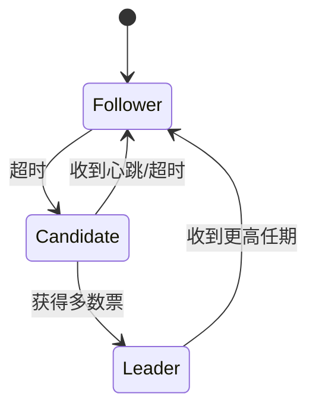

# Raft一致性算法设计文档

## 1. 概述

本设计文档详细描述了分布式配置中心使用Raft算法实现数据一致性的设计方案。Raft算法通过选举机制、日志复制和安全性保证，确保配置数据在集群中的一致性。

### 1.1 设计目标

- **高可用性：** 支持节点故障自动恢复
- **强一致性：** 保证数据一致性
- **高性能：** 最小化复制延迟
- **可维护性：** 易于理解和实现

### 1.2 核心组件

- **Leader选举：** 集群节点状态管理
- **日志复制：** 配置变更的复制机制
- **状态机：** 配置数据的应用机制
- **成员管理：** 集群节点管理

## 2. 节点状态

### 2.1 节点角色

1. **Leader：**
   - 处理所有客户端请求
   - 管理日志复制
   - 发送心跳包
   - 维护集群状态

2. **Follower：**
   - 响应Leader的心跳
   - 接收并应用日志
   - 转发客户端请求给Leader
   - 参与Leader选举

3. **Candidate：**
   - 参与Leader选举
   - 收集投票
   - 可能成为新的Leader

### 2.2 状态转换



## 3. 选举机制

### 3.1 选举触发条件

1. **Follower超时：**
   - 选举超时时间：150-300ms
   - 随机化避免选举冲突

2. **Leader故障：**
   - 心跳超时
   - 网络分区

### 3.2 选举过程

1. **准备阶段：**

   ```rust
   struct ElectionRequest {
       term: u64,           // 当前任期
       candidate_id: u64,   // 候选人ID
       last_log_index: u64, // 最后日志索引
       last_log_term: u64,  // 最后日志任期
   }
   ```

2. **投票规则：**
   - 任期号大于当前任期
   - 日志至少和自己一样新
   - 每个任期只能投票一次

3. **选举结果：**
   - 获得多数票成为Leader
   - 收到更高任期转为Follower
   - 超时后重新选举

### 3.3 选举优化

1. **预投票机制：**
   - 避免不必要的选举
   - 减少选举冲突

2. **选举超时随机化：**
   - 避免选举风暴
   - 提高选举成功率

## 4. 日志复制

### 4.1 日志结构

```rust
struct LogEntry {
    term: u64,           // 任期
    index: u64,          // 索引
    command: Command,    // 命令
    timestamp: i64,      // 时间戳
}

enum Command {
    SetConfig(Config),
    DeleteConfig(ConfigKey),
    UpdateConfig(Config),
}
```

### 4.2 复制流程

1. **Leader处理请求：**

   ```rust
   async fn handle_client_request(&mut self, request: ClientRequest) -> Result<Response> {
       // 1. 追加日志
       let entry = LogEntry::new(request);
       self.log.append(entry)?;
       
       // 2. 复制到Follower
       self.replicate_to_followers().await?;
       
       // 3. 提交日志
       self.commit_log()?;
       
       // 4. 应用到状态机
       self.apply_to_state_machine()?;
       
       Ok(Response::success())
   }
   ```

2. **Follower处理复制：**

   ```rust
   async fn handle_append_entries(&mut self, request: AppendEntriesRequest) -> Result<Response> {
       // 1. 检查任期
       if request.term < self.current_term {
           return Ok(Response::reject());
       }
       
       // 2. 检查日志一致性
       if !self.check_log_consistency(&request) {
           return Ok(Response::reject());
       }
       
       // 3. 追加日志
       self.append_entries(request.entries)?;
       
       // 4. 更新提交索引
       self.update_commit_index(request.leader_commit)?;
       
       Ok(Response::success())
   }
   ```

### 4.3 日志一致性检查

1. **一致性规则：**
   - 相同索引和任期的日志必须相同
   - 不同任期的日志必须不同
   - 日志必须连续

2. **不一致处理：**
   - 删除不一致的日志
   - 追加Leader的日志
   - 更新提交索引

## 5. 状态机

### 5.1 状态机接口

```rust
trait StateMachine {
    // 应用命令
    async fn apply(&mut self, command: Command) -> Result<()>;
    
    // 获取状态
    async fn get_state(&self) -> Result<State>;
    
    // 创建快照
    async fn create_snapshot(&self) -> Result<Snapshot>;
    
    // 应用快照
    async fn apply_snapshot(&mut self, snapshot: Snapshot) -> Result<()>;
}
```

### 5.2 配置状态机

```rust
struct ConfigStateMachine {
    db: Arc<Database>,
    cache: Arc<Cache>,
}

impl StateMachine for ConfigStateMachine {
    async fn apply(&mut self, command: Command) -> Result<()> {
        match command {
            Command::SetConfig(config) => {
                // 1. 写入数据库
                self.db.set_config(&config).await?;
                
                // 2. 更新缓存
                self.cache.set_config(&config).await?;
                
                Ok(())
            }
            Command::DeleteConfig(key) => {
                // 1. 删除数据库记录
                self.db.delete_config(&key).await?;
                
                // 2. 删除缓存
                self.cache.delete_config(&key).await?;
                
                Ok(())
            }
            Command::UpdateConfig(config) => {
                // 1. 更新数据库
                self.db.update_config(&config).await?;
                
                // 2. 更新缓存
                self.cache.update_config(&config).await?;
                
                Ok(())
            }
        }
    }
}
```

## 6. 成员管理

### 6.1 节点配置

```rust
struct NodeConfig {
    id: u64,
    address: String,
    role: NodeRole,
    term: u64,
    voted_for: Option<u64>,
    log: Log,
    state_machine: Arc<StateMachine>,
}
```

### 6.2 集群配置

```rust
struct ClusterConfig {
    nodes: HashMap<u64, NodeConfig>,
    leader_id: Option<u64>,
    current_term: u64,
    commit_index: u64,
    last_applied: u64,
}
```

### 6.3 成员变更

1. **添加节点：**
   - 同步日志
   - 更新集群配置
   - 等待新节点追上进度

2. **删除节点：**
   - 停止复制
   - 更新集群配置
   - 清理相关资源

3. **替换节点：**
   - 添加新节点
   - 等待同步完成
   - 删除旧节点

## 7. 性能优化

### 7.1 日志压缩

1. **快照机制：**
   - 定期创建快照
   - 压缩历史日志
   - 减少存储空间

2. **增量快照：**
   - 只保存变更数据
   - 减少传输数据量
   - 加快恢复速度

### 7.2 批量处理

1. **日志批处理：**
   - 合并多个日志
   - 减少网络请求
   - 提高吞吐量

2. **状态机批处理：**
   - 批量应用命令
   - 减少数据库操作
   - 提高处理效率

### 7.3 并发优化

1. **并行复制：**
   - 并发复制到Follower
   - 减少复制延迟
   - 提高复制效率

2. **状态机并发：**
   - 并发应用命令
   - 保证顺序性
   - 提高处理速度

## 8. 故障处理

### 8.1 节点故障

1. **Leader故障：**
   - 触发选举
   - 选择新Leader
   - 恢复服务

2. **Follower故障：**
   - 停止复制
   - 等待恢复
   - 重新同步

### 8.2 网络分区

1. **分区检测：**
   - 心跳超时
   - 连接断开
   - 选举失败

2. **分区恢复：**
   - 网络恢复
   - 重新选举
   - 数据同步

### 8.3 数据不一致

1. **不一致检测：**
   - 日志检查
   - 状态检查
   - 快照验证

2. **不一致修复：**
   - 日志回滚
   - 状态恢复
   - 快照恢复

## 9. 监控指标

### 9.1 性能指标

1. **选举指标：**
   - 选举次数
   - 选举延迟
   - 选举成功率

2. **复制指标：**
   - 复制延迟
   - 复制吞吐量
   - 复制失败率

3. **状态机指标：**
   - 应用延迟
   - 应用吞吐量
   - 应用失败率

### 9.2 健康指标

1. **节点健康：**
   - 节点状态
   - 心跳状态
   - 资源使用

2. **集群健康：**
   - 集群状态
   - 一致性状态
   - 可用性状态

## 10. 部署建议

### 10.1 集群规模

- 建议节点数：3-5个
- 最小节点数：3个
- 最大节点数：7个

### 10.2 硬件要求

1. **CPU：**
   - 4核及以上
   - 支持多线程

2. **内存：**
   - 8GB及以上
   - 支持大内存

3. **磁盘：**
   - SSD存储
   - 足够的存储空间

### 10.3 网络要求

1. **带宽：**
   - 千兆网络
   - 低延迟

2. **拓扑：**
   - 同机房部署
   - 避免跨机房

## 11. 总结

Raft算法通过选举机制、日志复制和状态机应用，为配置中心提供了强一致性保证。通过合理的优化和监控，可以确保系统的高可用性和高性能。
