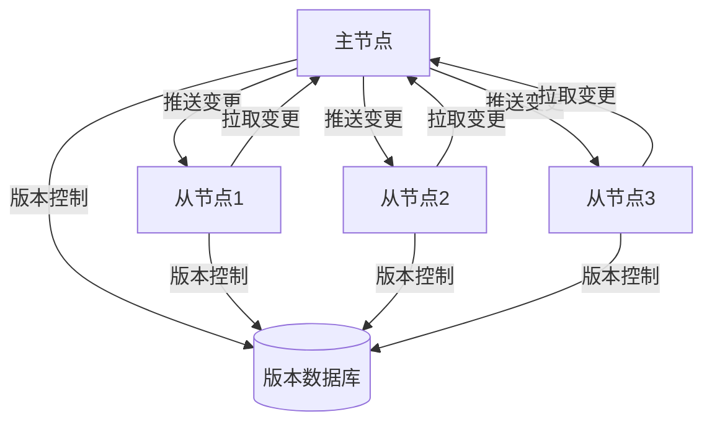

# 数据同步设计文档

## 1. 概述

本设计文档详细描述了分布式配置中心的数据同步机制，包括同步策略、同步流程、冲突解决等关键特性，确保多节点间的数据一致性。

### 1.1 设计目标

- **数据一致性：** 确保多节点间的数据最终一致性
- **高性能：** 同步过程对系统性能影响最小
- **可靠性：** 同步过程可靠，支持失败重试
- **实时性：** 数据变更及时同步到其他节点
- **可扩展性：** 支持动态扩展节点

### 1.2 核心组件

- **同步管理器：** 负责同步策略和流程控制
- **数据版本控制：** 管理数据版本和变更历史
- **冲突检测器：** 检测和解决数据冲突
- **同步执行器：** 执行具体的数据同步操作
- **状态监控器：** 监控同步状态和进度

## 2. 同步架构

### 2.1 整体架构



### 2.2 数据模型

```rust
#[derive(Debug, Clone)]
pub struct ConfigVersion {
    pub id: String,
    pub config_id: String,
    pub version: u64,
    pub content: String,
    pub checksum: String,
    pub created_at: DateTime<Utc>,
    pub created_by: String,
}

#[derive(Debug, Clone)]
pub struct SyncTask {
    pub id: String,
    pub source_node: String,
    pub target_node: String,
    pub version: u64,
    pub status: SyncStatus,
    pub created_at: DateTime<Utc>,
    pub updated_at: DateTime<Utc>,
}

#[derive(Debug, Clone, Copy, PartialEq)]
pub enum SyncStatus {
    Pending,    // 等待同步
    Running,    // 同步中
    Completed,  // 同步完成
    Failed,     // 同步失败
    Retrying,   // 重试中
}

#[derive(Debug, Clone)]
pub struct SyncConflict {
    pub id: String,
    pub config_id: String,
    pub version: u64,
    pub conflict_type: ConflictType,
    pub resolution: Option<ConflictResolution>,
    pub created_at: DateTime<Utc>,
    pub resolved_at: Option<DateTime<Utc>>,
}

#[derive(Debug, Clone, Copy, PartialEq)]
pub enum ConflictType {
    VersionConflict,    // 版本冲突
    ContentConflict,    // 内容冲突
    ConcurrentModification, // 并发修改
}

#[derive(Debug, Clone, Copy, PartialEq)]
pub enum ConflictResolution {
    AcceptSource,    // 接受源节点数据
    AcceptTarget,    // 接受目标节点数据
    Merge,          // 合并数据
    Custom,         // 自定义解决
}
```

## 3. 同步策略

### 3.1 推送策略

```rust
pub struct PushStrategy {
    batch_size: usize,
    push_interval: Duration,
    max_retries: u32,
}

impl PushStrategy {
    pub async fn push_changes(&self, leader: &NodeInfo, followers: &[NodeInfo]) -> Result<()> {
        // 获取待推送的变更
        let changes = self.get_pending_changes(leader.id).await?;
        
        // 分批推送
        for chunk in changes.chunks(self.batch_size) {
            // 并行推送到所有从节点
            let futures: Vec<_> = followers.iter()
                .map(|follower| self.push_to_follower(follower, chunk))
                .collect();
                
            // 等待所有推送完成
            let results = futures::future::join_all(futures).await;
            
            // 处理推送结果
            for (follower, result) in followers.iter().zip(results) {
                match result {
                    Ok(_) => self.handle_successful_push(follower.id, chunk).await?,
                    Err(e) => self.handle_failed_push(follower.id, chunk, e).await?,
                }
            }
        }
        
        Ok(())
    }

    async fn push_to_follower(&self, follower: &NodeInfo, changes: &[ConfigVersion]) -> Result<()> {
        let mut retries = 0;
        
        while retries < self.max_retries {
            match self.perform_push(follower, changes).await {
                Ok(_) => return Ok(()),
                Err(e) => {
                    retries += 1;
                    if retries == self.max_retries {
                        return Err(e);
                    }
                    tokio::time::sleep(self.push_interval).await;
                }
            }
        }
        
        Ok(())
    }

    async fn perform_push(&self, follower: &NodeInfo, changes: &[ConfigVersion]) -> Result<()> {
        let client = reqwest::Client::new();
        client
            .post(&format!("{}/sync/push", follower.address))
            .json(changes)
            .send()
            .await?;
            
        Ok(())
    }
}
```

### 3.2 拉取策略

```rust
pub struct PullStrategy {
    pull_interval: Duration,
    batch_size: usize,
    max_lag: Duration,
}

impl PullStrategy {
    pub async fn pull_changes(&self, follower: &NodeInfo, leader: &NodeInfo) -> Result<()> {
        // 获取本地版本
        let local_version = self.get_local_version(follower.id).await?;
        
        // 获取主节点版本
        let leader_version = self.get_leader_version(leader.id).await?;
        
        // 如果版本不一致，进行拉取
        if local_version < leader_version {
            self.perform_pull(follower, leader, local_version, leader_version).await?;
        }
        
        Ok(())
    }

    async fn perform_pull(&self, follower: &NodeInfo, leader: &NodeInfo, 
                         from_version: u64, to_version: u64) -> Result<()> {
        // 分批拉取数据
        let mut current_version = from_version;
        
        while current_version < to_version {
            // 计算本次拉取的版本范围
            let end_version = (current_version + self.batch_size as u64)
                .min(to_version);
            
            // 拉取数据
            let changes = self.pull_changes_batch(leader, current_version, end_version).await?;
            
            // 应用变更
            self.apply_changes(follower, &changes).await?;
            
            // 更新版本
            current_version = end_version + 1;
        }
        
        Ok(())
    }

    async fn pull_changes_batch(&self, leader: &NodeInfo, 
                              from_version: u64, to_version: u64) -> Result<Vec<ConfigVersion>> {
        let client = reqwest::Client::new();
        let response = client
            .get(&format!("{}/sync/pull", leader.address))
            .query(&[
                ("from_version", from_version.to_string()),
                ("to_version", to_version.to_string()),
            ])
            .send()
            .await?;
            
        Ok(response.json().await?)
    }
}
```

## 4. 版本控制

### 4.1 版本管理

```rust
pub struct VersionManager {
    db: Arc<Database>,
    cache: Arc<Redis>,
}

impl VersionManager {
    pub async fn create_version(&self, config: &Config) -> Result<ConfigVersion> {
        // 生成新版本
        let version = ConfigVersion {
            id: Uuid::new_v4().to_string(),
            config_id: config.id.clone(),
            version: self.get_next_version(config.id).await?,
            content: config.content.clone(),
            checksum: self.calculate_checksum(&config.content),
            created_at: Utc::now(),
            created_by: config.modified_by.clone(),
        };
        
        // 保存版本
        self.save_version(&version).await?;
        
        // 更新缓存
        self.update_cache(&version).await?;
        
        Ok(version)
    }

    async fn get_next_version(&self, config_id: &str) -> Result<u64> {
        // 获取当前版本
        let current_version = self.get_current_version(config_id).await?;
        
        // 返回下一个版本号
        Ok(current_version + 1)
    }

    async fn calculate_checksum(&self, content: &str) -> String {
        let mut hasher = Sha256::new();
        hasher.update(content.as_bytes());
        format!("{:x}", hasher.finalize())
    }

    async fn save_version(&self, version: &ConfigVersion) -> Result<()> {
        // 保存到数据库
        self.db.insert_version(version).await?;
        
        Ok(())
    }

    async fn update_cache(&self, version: &ConfigVersion) -> Result<()> {
        // 更新版本缓存
        self.cache.set(
            &format!("version:{}", version.id),
            version,
            Some(Duration::from_secs(3600)),
        ).await?;
        
        // 更新最新版本缓存
        self.cache.set(
            &format!("config:{}:latest", version.config_id),
            version,
            Some(Duration::from_secs(3600)),
        ).await?;
        
        Ok(())
    }
}
```

### 4.2 版本比较

```rust
impl VersionManager {
    pub async fn compare_versions(&self, version1: &ConfigVersion, 
                                version2: &ConfigVersion) -> Result<VersionDiff> {
        // 比较版本号
        if version1.version != version2.version {
            return Ok(VersionDiff::VersionMismatch {
                version1: version1.version,
                version2: version2.version,
            });
        }
        
        // 比较校验和
        if version1.checksum != version2.checksum {
            return Ok(VersionDiff::ContentMismatch {
                checksum1: version1.checksum.clone(),
                checksum2: version2.checksum.clone(),
            });
        }
        
        Ok(VersionDiff::Identical)
    }

    pub async fn get_version_history(&self, config_id: &str) -> Result<Vec<ConfigVersion>> {
        // 获取版本历史
        let versions = self.db.get_version_history(config_id).await?;
        
        // 按版本号排序
        let mut sorted_versions = versions;
        sorted_versions.sort_by_key(|v| v.version);
        
        Ok(sorted_versions)
    }

    pub async fn rollback_version(&self, config_id: &str, target_version: u64) -> Result<()> {
        // 获取目标版本
        let target = self.get_version(config_id, target_version).await?;
        
        // 创建回滚版本
        let rollback = ConfigVersion {
            id: Uuid::new_v4().to_string(),
            config_id: config_id.to_string(),
            version: self.get_next_version(config_id).await?,
            content: target.content.clone(),
            checksum: target.checksum.clone(),
            created_at: Utc::now(),
            created_by: "system".to_string(),
        };
        
        // 保存回滚版本
        self.save_version(&rollback).await?;
        
        Ok(())
    }
}
```

## 5. 冲突解决

### 5.1 冲突检测

```rust
pub struct ConflictDetector {
    db: Arc<Database>,
    cache: Arc<Redis>,
}

impl ConflictDetector {
    pub async fn detect_conflicts(&self, config_id: &str) -> Result<Vec<SyncConflict>> {
        // 获取所有节点的版本
        let versions = self.get_node_versions(config_id).await?;
        
        // 检测冲突
        let mut conflicts = Vec::new();
        
        for (node_id, version) in versions {
            if let Some(conflict) = self.check_conflict(config_id, &node_id, &version).await? {
                conflicts.push(conflict);
            }
        }
        
        Ok(conflicts)
    }

    async fn check_conflict(&self, config_id: &str, node_id: &str, 
                          version: &ConfigVersion) -> Result<Option<SyncConflict>> {
        // 获取主节点版本
        let master_version = self.get_master_version(config_id).await?;
        
        // 比较版本
        if version.version != master_version.version {
            return Ok(Some(SyncConflict {
                id: Uuid::new_v4().to_string(),
                config_id: config_id.to_string(),
                version: version.version,
                conflict_type: ConflictType::VersionConflict,
                resolution: None,
                created_at: Utc::now(),
                resolved_at: None,
            }));
        }
        
        // 比较内容
        if version.checksum != master_version.checksum {
            return Ok(Some(SyncConflict {
                id: Uuid::new_v4().to_string(),
                config_id: config_id.to_string(),
                version: version.version,
                conflict_type: ConflictType::ContentConflict,
                resolution: None,
                created_at: Utc::now(),
                resolved_at: None,
            }));
        }
        
        Ok(None)
    }

    async fn resolve_conflict(&self, conflict: &SyncConflict, 
                            resolution: ConflictResolution) -> Result<()> {
        // 更新冲突状态
        self.update_conflict_status(conflict.id, resolution).await?;
        
        // 执行冲突解决
        match resolution {
            ConflictResolution::AcceptSource => {
                self.accept_source_version(conflict).await?;
            }
            ConflictResolution::AcceptTarget => {
                self.accept_target_version(conflict).await?;
            }
            ConflictResolution::Merge => {
                self.merge_versions(conflict).await?;
            }
            ConflictResolution::Custom => {
                self.apply_custom_resolution(conflict).await?;
            }
        }
        
        Ok(())
    }
}
```

### 5.2 冲突解决策略

```rust
impl ConflictDetector {
    async fn accept_source_version(&self, conflict: &SyncConflict) -> Result<()> {
        // 获取源节点版本
        let source_version = self.get_source_version(conflict).await?;
        
        // 更新目标节点版本
        self.update_target_version(conflict, &source_version).await?;
        
        Ok(())
    }

    async fn accept_target_version(&self, conflict: &SyncConflict) -> Result<()> {
        // 获取目标节点版本
        let target_version = self.get_target_version(conflict).await?;
        
        // 更新源节点版本
        self.update_source_version(conflict, &target_version).await?;
        
        Ok(())
    }

    async fn merge_versions(&self, conflict: &SyncConflict) -> Result<()> {
        // 获取源节点和目标节点版本
        let source_version = self.get_source_version(conflict).await?;
        let target_version = self.get_target_version(conflict).await?;
        
        // 合并版本
        let merged_version = self.merge_version_content(&source_version, &target_version)?;
        
        // 创建新版本
        let new_version = ConfigVersion {
            id: Uuid::new_v4().to_string(),
            config_id: conflict.config_id.clone(),
            version: self.get_next_version(&conflict.config_id).await?,
            content: merged_version,
            checksum: self.calculate_checksum(&merged_version),
            created_at: Utc::now(),
            created_by: "system".to_string(),
        };
        
        // 保存合并版本
        self.save_version(&new_version).await?;
        
        Ok(())
    }

    async fn apply_custom_resolution(&self, conflict: &SyncConflict) -> Result<()> {
        // 获取自定义解决策略
        let resolution = self.get_custom_resolution(conflict).await?;
        
        // 应用自定义解决策略
        resolution.apply(conflict).await?;
        
        Ok(())
    }
}
```

## 6. 同步监控

### 6.1 同步状态监控

```rust
pub struct SyncMonitor {
    metrics: Arc<Metrics>,
    alert_thresholds: HashMap<String, f64>,
}

impl SyncMonitor {
    pub async fn monitor_sync_status(&self) -> Result<()> {
        // 收集同步指标
        let metrics = self.collect_sync_metrics().await?;
        
        // 检查告警阈值
        self.check_alert_thresholds(&metrics).await?;
        
        // 更新监控面板
        self.update_dashboard(&metrics).await?;
        
        Ok(())
    }

    async fn collect_sync_metrics(&self) -> Result<HashMap<String, f64>> {
        let mut metrics = HashMap::new();
        
        // 收集同步延迟
        metrics.insert("sync_lag".to_string(), self.get_sync_lag().await?);
        
        // 收集同步成功率
        metrics.insert("sync_success_rate".to_string(), self.get_sync_success_rate().await?);
        
        // 收集冲突数量
        metrics.insert("conflict_count".to_string(), self.get_conflict_count().await?);
        
        // 收集重试次数
        metrics.insert("retry_count".to_string(), self.get_retry_count().await?);
        
        Ok(metrics)
    }

    async fn check_alert_thresholds(&self, metrics: &HashMap<String, f64>) -> Result<()> {
        for (metric, value) in metrics {
            if let Some(threshold) = self.alert_thresholds.get(metric) {
                if value > threshold {
                    self.send_alert(metric, *value, *threshold).await?;
                }
            }
        }
        
        Ok(())
    }
}
```

### 6.2 同步进度监控

```rust
impl SyncMonitor {
    async fn monitor_sync_progress(&self) -> Result<()> {
        // 获取所有同步任务
        let tasks = self.get_sync_tasks().await?;
        
        // 监控每个任务的进度
        for task in tasks {
            if let Err(e) = self.monitor_task_progress(&task).await {
                error!("Failed to monitor task {}: {}", task.id, e);
            }
        }
        
        Ok(())
    }

    async fn monitor_task_progress(&self, task: &SyncTask) -> Result<()> {
        // 获取任务进度
        let progress = self.get_task_progress(task.id).await?;
        
        // 检查进度是否正常
        if !self.is_progress_normal(&progress) {
            self.handle_abnormal_progress(task, &progress).await?;
        }
        
        // 更新进度指标
        self.update_progress_metrics(task, &progress).await?;
        
        Ok(())
    }

    async fn handle_abnormal_progress(&self, task: &SyncTask, 
                                    progress: &TaskProgress) -> Result<()> {
        // 检查是否需要重试
        if self.should_retry_task(task, progress) {
            self.retry_task(task).await?;
        }
        
        // 检查是否需要告警
        if self.should_alert(task, progress) {
            self.send_progress_alert(task, progress).await?;
        }
        
        Ok(())
    }
}
```

## 7. 总结

数据同步设计通过推送和拉取策略、版本控制、冲突解决和监控机制，确保了配置中心多节点间的数据一致性，提供了可靠的数据同步服务。
