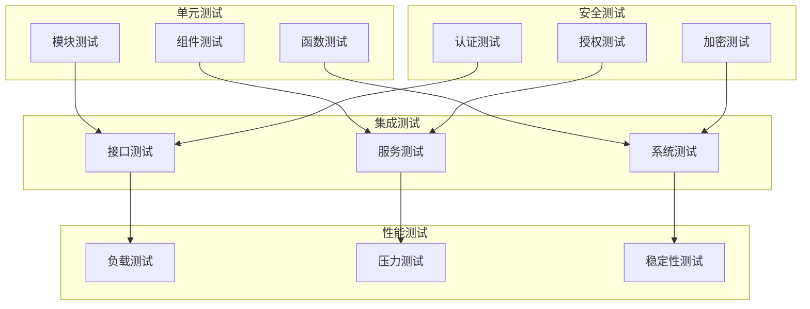

# 测试设计文档

## 1. 概述

本设计文档详细描述了分布式配置中心的测试策略、测试用例和测试环境，确保系统的质量和可靠性。

### 1.1 设计目标

- **全面性：** 覆盖所有功能点和关键路径
- **可靠性：** 确保测试结果的准确性和可重复性
- **自动化：** 支持自动化测试和持续集成
- **可维护性：** 测试用例易于维护和扩展
- **性能：** 测试执行高效且资源消耗合理

### 1.2 测试类型



## 2. 测试环境

### 2.1 环境配置

```rust
#[derive(Debug, Clone)]
pub struct TestEnvironment {
    pub test_type: TestType,
    pub resources: TestResources,
    pub services: TestServices,
    pub data: TestData,
}

#[derive(Debug, Clone)]
pub enum TestType {
    Unit,
    Integration,
    Performance,
    Security,
}

#[derive(Debug, Clone)]
pub struct TestResources {
    pub cpu: u32,
    pub memory: u64,
    pub disk: u64,
    pub network: NetworkConfig,
}

#[derive(Debug, Clone)]
pub struct NetworkConfig {
    pub bandwidth: u64,
    pub latency: u32,
    pub packet_loss: f64,
}

#[derive(Debug, Clone)]
pub struct TestServices {
    pub database: DatabaseConfig,
    pub cache: CacheConfig,
    pub raft: RaftConfig,
    pub monitoring: MonitoringConfig,
}

#[derive(Debug, Clone)]
pub struct TestData {
    pub fixtures: Vec<TestFixture>,
    pub generators: Vec<DataGenerator>,
}

impl TestEnvironment {
    pub async fn setup(&self) -> Result<()> {
        // 准备测试环境
        self.prepare_environment().await?;
        
        // 启动测试服务
        self.start_services().await?;
        
        // 加载测试数据
        self.load_test_data().await?;
        
        Ok(())
    }

    pub async fn teardown(&self) -> Result<()> {
        // 清理测试数据
        self.cleanup_test_data().await?;
        
        // 停止测试服务
        self.stop_services().await?;
        
        // 清理测试环境
        self.cleanup_environment().await?;
        
        Ok(())
    }
}
```

### 2.2 测试数据

```rust
#[derive(Debug, Clone)]
pub struct TestDataManager {
    pub fixtures: HashMap<String, TestFixture>,
    pub generators: HashMap<String, DataGenerator>,
}

#[derive(Debug, Clone)]
pub struct TestFixture {
    pub name: String,
    pub data: Vec<TestDataItem>,
    pub dependencies: Vec<String>,
}

#[derive(Debug, Clone)]
pub struct TestDataItem {
    pub table: String,
    pub records: Vec<HashMap<String, Value>>,
}

#[derive(Debug, Clone)]
pub struct DataGenerator {
    pub name: String,
    pub rules: Vec<GenerationRule>,
    pub count: u32,
}

#[derive(Debug, Clone)]
pub struct GenerationRule {
    pub field: String,
    pub type_: DataType,
    pub constraints: Vec<Constraint>,
}

impl TestDataManager {
    pub async fn load_fixtures(&self) -> Result<()> {
        for (name, fixture) in &self.fixtures {
            // 加载依赖
            for dep in &fixture.dependencies {
                self.load_fixture(dep).await?;
            }
            
            // 加载数据
            self.load_fixture_data(name).await?;
        }
        
        Ok(())
    }

    pub async fn generate_data(&self) -> Result<()> {
        for (name, generator) in &self.generators {
            // 生成数据
            let data = self.generate_test_data(generator).await?;
            
            // 保存数据
            self.save_test_data(name, &data).await?;
        }
        
        Ok(())
    }
}
```

## 3. 测试用例

### 3.1 单元测试

```rust
#[cfg(test)]
mod tests {
    use super::*;

    #[tokio::test]
    async fn test_config_creation() {
        // 准备测试数据
        let config = Config::new(
            "test_namespace",
            "test_key",
            "test_value",
            "yaml",
        );

        // 验证配置创建
        assert_eq!(config.namespace, "test_namespace");
        assert_eq!(config.key, "test_key");
        assert_eq!(config.value, "test_value");
        assert_eq!(config.format, "yaml");
    }

    #[tokio::test]
    async fn test_config_validation() {
        // 测试有效配置
        let valid_config = Config::new(
            "test_namespace",
            "test_key",
            "valid: yaml",
            "yaml",
        );
        assert!(valid_config.validate().is_ok());

        // 测试无效配置
        let invalid_config = Config::new(
            "test_namespace",
            "test_key",
            "invalid: yaml: :",
            "yaml",
        );
        assert!(invalid_config.validate().is_err());
    }

    #[tokio::test]
    async fn test_config_encryption() {
        // 准备测试数据
        let config = Config::new(
            "test_namespace",
            "test_key",
            "sensitive_data",
            "text",
        );

        // 测试加密
        let encrypted = config.encrypt().await.unwrap();
        assert_ne!(encrypted.value, "sensitive_data");

        // 测试解密
        let decrypted = encrypted.decrypt().await.unwrap();
        assert_eq!(decrypted.value, "sensitive_data");
    }
}
```

### 3.2 集成测试

```rust
#[cfg(test)]
mod integration_tests {
    use super::*;

    #[tokio::test]
    async fn test_config_flow() {
        // 准备测试环境
        let env = TestEnvironment::new().await.unwrap();
        
        // 创建配置
        let config = Config::new(
            "test_namespace",
            "test_key",
            "test_value",
            "yaml",
        );
        
        // 保存配置
        let saved = env.config_service.save_config(&config).await.unwrap();
        assert!(saved.id.is_some());
        
        // 获取配置
        let retrieved = env.config_service.get_config(&saved.id.unwrap()).await.unwrap();
        assert_eq!(retrieved.value, "test_value");
        
        // 更新配置
        let updated = env.config_service.update_config(
            &saved.id.unwrap(),
            "new_value",
        ).await.unwrap();
        assert_eq!(updated.value, "new_value");
        
        // 删除配置
        env.config_service.delete_config(&saved.id.unwrap()).await.unwrap();
        assert!(env.config_service.get_config(&saved.id.unwrap()).await.is_err());
    }

    #[tokio::test]
    async fn test_raft_consensus() {
        // 准备Raft集群
        let cluster = RaftCluster::new(3).await.unwrap();
        
        // 等待集群稳定
        cluster.wait_for_leader().await.unwrap();
        
        // 提交配置
        let config = Config::new(
            "test_namespace",
            "test_key",
            "test_value",
            "yaml",
        );
        
        let result = cluster.submit_config(&config).await.unwrap();
        assert!(result.success);
        
        // 验证所有节点
        for node in cluster.nodes() {
            let value = node.get_config(&config.id.unwrap()).await.unwrap();
            assert_eq!(value, "test_value");
        }
    }
}
```

### 3.3 性能测试

```rust
#[cfg(test)]
mod performance_tests {
    use super::*;

    #[tokio::test]
    async fn test_config_read_performance() {
        // 准备测试数据
        let env = TestEnvironment::new().await.unwrap();
        let configs = generate_test_configs(1000);
        
        // 保存测试数据
        for config in &configs {
            env.config_service.save_config(config).await.unwrap();
        }
        
        // 测试读取性能
        let start = Instant::now();
        for config in &configs {
            env.config_service.get_config(&config.id.unwrap()).await.unwrap();
        }
        let duration = start.elapsed();
        
        // 验证性能指标
        assert!(duration.as_secs_f64() < 5.0); // 1000次读取应在5秒内完成
    }

    #[tokio::test]
    async fn test_concurrent_access() {
        // 准备测试环境
        let env = TestEnvironment::new().await.unwrap();
        
        // 创建并发任务
        let mut tasks = Vec::new();
        for i in 0..100 {
            let task = tokio::spawn(async move {
                let config = Config::new(
                    "test_namespace",
                    &format!("key_{}", i),
                    &format!("value_{}", i),
                    "yaml",
                );
                env.config_service.save_config(&config).await
            });
            tasks.push(task);
        }
        
        // 等待所有任务完成
        let results = futures::future::join_all(tasks).await;
        
        // 验证结果
        for result in results {
            assert!(result.unwrap().is_ok());
        }
    }
}
```

### 3.4 安全测试

```rust
#[cfg(test)]
mod security_tests {
    use super::*;

    #[tokio::test]
    async fn test_authentication() {
        // 准备测试环境
        let env = TestEnvironment::new().await.unwrap();
        
        // 测试有效认证
        let token = env.auth_service.authenticate(
            "test_user",
            "correct_password",
        ).await.unwrap();
        assert!(token.is_valid());
        
        // 测试无效认证
        let result = env.auth_service.authenticate(
            "test_user",
            "wrong_password",
        ).await;
        assert!(result.is_err());
    }

    #[tokio::test]
    async fn test_authorization() {
        // 准备测试环境
        let env = TestEnvironment::new().await.unwrap();
        
        // 测试权限检查
        let has_permission = env.rbac_service.check_permission(
            "test_user",
            "config:read",
            "test_namespace",
        ).await.unwrap();
        assert!(has_permission);
        
        // 测试无权限访问
        let has_permission = env.rbac_service.check_permission(
            "test_user",
            "config:write",
            "test_namespace",
        ).await.unwrap();
        assert!(!has_permission);
    }

    #[tokio::test]
    async fn test_data_encryption() {
        // 准备测试数据
        let sensitive_data = "sensitive_config_value";
        
        // 测试加密
        let encrypted = env.encryption_service.encrypt(sensitive_data).await.unwrap();
        assert_ne!(encrypted, sensitive_data);
        
        // 测试解密
        let decrypted = env.encryption_service.decrypt(&encrypted).await.unwrap();
        assert_eq!(decrypted, sensitive_data);
    }
}
```

## 4. 测试工具

### 4.1 测试框架

```rust
#[derive(Debug, Clone)]
pub struct TestFramework {
    pub runner: TestRunner,
    pub reporter: TestReporter,
    pub analyzer: TestAnalyzer,
}

#[derive(Debug, Clone)]
pub struct TestRunner {
    pub parallel: bool,
    pub timeout: Duration,
    pub retries: u32,
}

#[derive(Debug, Clone)]
pub struct TestReporter {
    pub format: ReportFormat,
    pub output: String,
    pub metrics: Vec<String>,
}

#[derive(Debug, Clone)]
pub enum ReportFormat {
    Text,
    Json,
    Html,
    Xml,
}

impl TestFramework {
    pub async fn run_tests(&self) -> Result<TestResults> {
        // 收集测试用例
        let tests = self.collect_tests().await?;
        
        // 运行测试
        let results = self.runner.run(&tests).await?;
        
        // 分析结果
        let analysis = self.analyzer.analyze(&results).await?;
        
        // 生成报告
        self.reporter.generate_report(&results, &analysis).await?;
        
        Ok(results)
    }
}
```

### 4.2 测试辅助工具

```rust
#[derive(Debug, Clone)]
pub struct TestHelpers {
    pub mock: MockHelper,
    pub fixture: FixtureHelper,
    pub assertion: AssertionHelper,
}

#[derive(Debug, Clone)]
pub struct MockHelper {
    pub mocks: HashMap<String, Box<dyn Mock>>,
}

#[derive(Debug, Clone)]
pub struct FixtureHelper {
    pub fixtures: HashMap<String, TestFixture>,
}

#[derive(Debug, Clone)]
pub struct AssertionHelper {
    pub custom_assertions: Vec<Box<dyn CustomAssertion>>,
}

impl TestHelpers {
    pub fn mock_service(&mut self, name: &str, mock: Box<dyn Mock>) {
        self.mock.mocks.insert(name.to_string(), mock);
    }

    pub fn load_fixture(&mut self, name: &str, fixture: TestFixture) {
        self.fixture.fixtures.insert(name.to_string(), fixture);
    }

    pub fn add_assertion(&mut self, assertion: Box<dyn CustomAssertion>) {
        self.assertion.custom_assertions.push(assertion);
    }
}
```

## 5. 持续集成

### 5.1 CI配置

```rust
#[derive(Debug, Clone)]
pub struct CIConfig {
    pub pipeline: PipelineConfig,
    pub stages: Vec<Stage>,
    pub artifacts: Vec<Artifact>,
}

#[derive(Debug, Clone)]
pub struct PipelineConfig {
    pub trigger: TriggerConfig,
    pub cache: CacheConfig,
    pub timeout: Duration,
}

#[derive(Debug, Clone)]
pub struct Stage {
    pub name: String,
    pub jobs: Vec<Job>,
    pub dependencies: Vec<String>,
}

#[derive(Debug, Clone)]
pub struct Job {
    pub name: String,
    pub script: Vec<String>,
    pub artifacts: Vec<String>,
    pub timeout: Duration,
}

impl CIConfig {
    pub async fn execute(&self) -> Result<()> {
        // 准备环境
        self.prepare_environment().await?;
        
        // 执行流水线
        for stage in &self.stages {
            // 检查依赖
            if !self.check_dependencies(stage).await? {
                continue;
            }
            
            // 执行任务
            for job in &stage.jobs {
                self.execute_job(job).await?;
            }
            
            // 收集制品
            self.collect_artifacts(stage).await?;
        }
        
        Ok(())
    }
}
```

### 5.2 测试报告

```rust
#[derive(Debug, Clone)]
pub struct TestReport {
    pub summary: TestSummary,
    pub details: Vec<TestDetail>,
    pub metrics: TestMetrics,
}

#[derive(Debug, Clone)]
pub struct TestSummary {
    pub total: u32,
    pub passed: u32,
    pub failed: u32,
    pub skipped: u32,
    pub duration: Duration,
}

#[derive(Debug, Clone)]
pub struct TestDetail {
    pub name: String,
    pub status: TestStatus,
    pub duration: Duration,
    pub error: Option<String>,
    pub stack_trace: Option<String>,
}

#[derive(Debug, Clone)]
pub struct TestMetrics {
    pub coverage: f64,
    pub performance: HashMap<String, f64>,
    pub reliability: HashMap<String, f64>,
}

impl TestReport {
    pub fn generate(&self) -> String {
        format!(
            r#"
            Test Report
            ===========
            
            Summary:
            - Total: {}
            - Passed: {}
            - Failed: {}
            - Skipped: {}
            - Duration: {:?}
            
            Coverage: {:.2}%
            
            Performance Metrics:
            {}
            
            Reliability Metrics:
            {}
            
            Failed Tests:
            {}
            "#,
            self.summary.total,
            self.summary.passed,
            self.summary.failed,
            self.summary.skipped,
            self.summary.duration,
            self.metrics.coverage,
            self.format_metrics(&self.metrics.performance),
            self.format_metrics(&self.metrics.reliability),
            self.format_failed_tests(),
        )
    }
}
```

## 6. 总结

测试设计通过全面的测试策略、完善的测试用例和自动化的测试工具，确保了配置中心的质量和可靠性。
